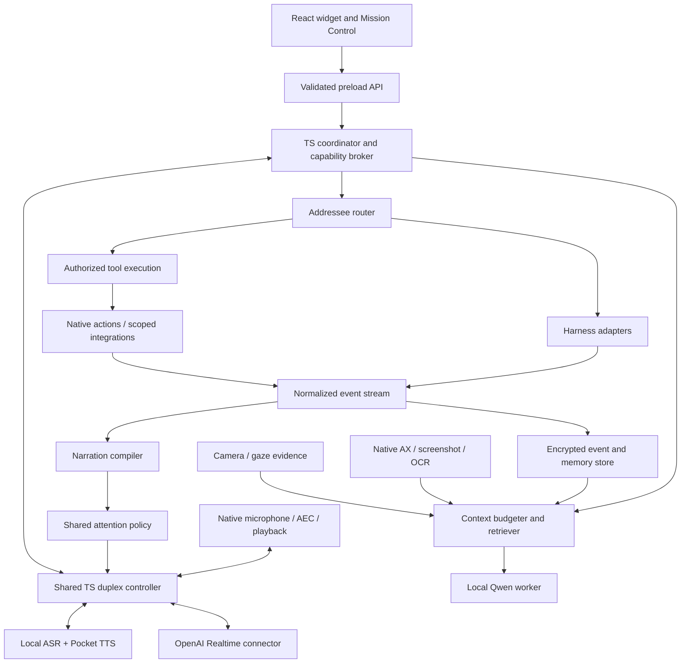

# EchoPilot — Hands-Free AI Agent Companion

Implementation plan • 8 September 2026 • Incorporates the preference for TypeScript

## 1. Executive Summary

EchoPilot is a persistent voice companion for people working with coding agents. It turns speech into contextually correct instructions, turns agent activity into useful spoken explanations, remembers the state of projects across days, and eventually helps users act across the desktop using speech and gaze. Its normal presence is a small floating widget. A secondary Mission Control window provides settings, history, evidence, permissions, and project management.

Build contextual dictation and a stateful, two-way coding-agent companion first. Prove that a user can dictate a technically correct request, hear meaningful results, interrupt, ask a follow-up, send a revised instruction to the correct agent, leave, and resume the next day. Desktop-wide execution and gaze follow this working foundation.

**Platform decision: Electron + React + TypeScript, macOS first, with a narrow, signed Swift helper for macOS capabilities.** Most application code—including memory, narration, routing, permissions policy, adapters, and UI—is TypeScript. Audio callbacks, accessibility, targeted capture, and selected on-device inference remain native. Electron creates an installable macOS application, but its interface uses Chromium rather than native AppKit controls. It offers the best maintenance fit for a TypeScript developer; it does not make every operating-system feature available without native code.

**Local voice decision: Kyutai Pocket TTS, the English `english_2026-04` configuration, is the single bundled default voice model.** Combine it with local Whisper ASR, a local Qwen3.5-4B reasoning/vision model, and EchoPilot's shared duplex controller. This is a genuinely concurrent listening/speaking application built from separate models; Pocket TTS itself is not a native full-duplex speech-to-speech model. This interpretation of “voice/full-duplex model” is deliberate: the small open-source voice model meets the resource and controllable-narration requirements more credibly than making a large research speech model mandatory. Section 3 evaluates Moshi, MoshiRAG, PersonaPlex, and Nemotron and explains the trade-off explicitly.

**Premium voice decision: OpenAI Realtime using `gpt-realtime`, with a user-supplied OpenAI API key.** It provides the richer conversational path. Both local and premium modes use the same routing, memory tools, attention policy, action authorization, and playback controls. Changing the voice backend must not change what the assistant is authorized to do.

Persistent understanding lives in a local encrypted event-and-memory store, not in an indefinitely growing chat transcript. Every inference request passes a deterministic context budgeter. Summaries retain evidence, uncertainty, decisions, unresolved work, and temporal validity. The assistant can retrieve older evidence without loading whole histories. Capability is broad: users can authorize project writes, harness control, desktop actions, command execution, and network access through visible, scoped, revocable grants.

## 2. Assumptions & Judgment Calls

The brief refers to assumptions as “Section 3” in one place and build sequence as “3.8” in another. This document follows the explicitly required eight-section order: assumptions are Section 2; build sequence is Section 8.

| Decision | Resolution and rationale |
|---|---|
| Product name | Use EchoPilot, matching the workspace. |
| Deliverable | A build specification and executable dependency structure, not an application implementation. Performance numbers below are release targets unless explicitly attributed to an upstream benchmark. No local model benchmark was performed during this planning exercise. |
| Developer experience | Optimize everyday development for TypeScript. Native implementation is a bounded package with generated TS interfaces, prebuilt development binaries, and fixtures; a product developer should rarely edit Swift. |
| Platform | macOS 15 or newer on Apple Silicon. Full local experience is supported on M2/16 GB and newer only after the defined benchmark gates pass. M4/24 GB is the reference performance machine. Intel Macs, Windows packaging, and Linux packaging are outside the first release. |
| Distribution | Direct, Developer ID signed and notarized distribution. No Mac App Store dependency. OS permissions remain mandatory. |
| Open source | First-party application code under Apache-2.0; preserve separate licenses for dependencies, models, and voice recordings. Open weights do not imply that training data or all model artifacts meet a single definition of open source. |
| Local voice | Pocket TTS is the one default local voice model, not a menu of competing defaults. Native neural duplex models are prior art and benchmark references, not mandatory downloads. The compositional design has weaker spontaneous prosody and overlap behavior than the premium path. |
| Zero configuration | The normal full installer contains signed runtimes and the selected model assets; it requires no Python, Homebrew, model account, API key, or manual model selection. OS permission grants and choosing a project are onboarding, not model setup. A smaller online installer may fetch the identical signed pack automatically. A full offline installer remains available. |
| Local reasoning | Qwen3.5-4B, reproducibly quantized to 4-bit MLX weights with group size 64, reasoning mode disabled, is the bundled text/vision model. It handles correction, structured extraction, routing ambiguity, and grounded answers. It does not replace the coding harness's model. |
| Premium scope | Entering an OpenAI key and enabling premium voice authorizes voice traffic to OpenAI. Screen pixels and memory exports require separate data scopes. Background consolidation stays local by default. Other provider keys may be attached to harnesses or an advanced text-provider adapter; there is one recommended premium voice provider. |
| Language | First release guarantees English conversation and English technical dictation, including identifiers and occasional foreign proper names. Additional dictation languages are download packs after separate evaluation. Do not advertise universal multilingual voice parity. |
| Hands-free activation | User can enable an explicit continuous conversation session once, then work hands-free until mute, lock, or session exit. At rest the microphone is closed. A wake-word standby option is a later expansion with its own permission and energy budget. |
| Default presentation | A 48–64 point widget is the primary surface from the first slice. Early versions restrict its context to the chosen project/harness; desktop-wide context comes later. Mission Control is never required to remain open. |
| Capturing “invisibly” | Capture is unobtrusive after permission, with an honest widget indicator and OS indicators. It is not covert. Default capture is event-triggered, scoped to the active permitted window, and short-lived. |
| Default context | Selected text and accessibility structure take precedence; screenshot and OCR supplement them. Clipboard reading is off until separately granted. No default continuous screen video or system-audio recording. |
| Existing sessions | Observe existing supported sessions through documented hooks or explicit log imports. Bidirectional control is guaranteed for EchoPilot-managed sessions. Attaching to an arbitrary already-running TUI is not assumed to provide an input API. |
| Relationship memory | One local human profile, many projects, sessions, branches, and worktrees. No account is necessary. Memory persists until deletion; raw artifacts follow retention limits. Cross-project recall is opt-in except explicitly global preferences. |
| Autonomy | All listed action classes are technically supported. Default project grants allow requested workspace work; external side effects request approval until a matching durable grant exists. Broad Host Autonomy is a selectable profile with clear authority boundaries. |
| Gaze confirmation | Consequential actions whose target is inferred from gaze always require explicit confirmation of the resolved target and effect. This is a specific requirement of the brief and cannot be replaced with dwell or a generic autonomy grant. Other actions follow normal grants. |
| Resource constraint | “Lightweight” means quantified idle CPU, energy, memory, capture frequency, model residency, and backlog limits—not pretending a local model has a tiny active footprint. Electron's overhead is an accepted, measured cost of the TS preference. |
| Offline behavior | Dictation, local conversation, local history, memory search, permitted desktop actions, and imported-log analysis work offline once installed. Cloud-backed coding agents still depend on their own service. EchoPilot reports that distinction. |
| Sync | Local encrypted export/import and backup are included. Automatic cross-device/cloud sync, team-shared memory, and mobile companion applications are excluded from v1. |
| Planning estimates | One engineering day is six focused implementation hours. Ticket estimates include local verification; calendar ranges include integration and specialist work. Parallel blocks reduce code conflicts, not the need for integration testing. |

## 3. Prior Art Review

This is an opinionated survey of leading and directly relevant projects, based on primary repositories, model cards, research papers, and vendor documentation reviewed for this plan. Upstream claims are not EchoPilot performance guarantees. Adoption means embedding an implementation; adaptation means using a documented idea with EchoPilot-owned interfaces; rejection means declining it as a production dependency, not denying its usefulness.

### 3.1 Dictation and context capture

| Prior art | Evaluation and decision |
|---|---|
| [Handy](https://github.com/cjpais/Handy) | A credible offline, cross-platform dictation application using a desktop wrapper and local speech recognition. Adapt its hotkey-to-transcript-to-insertion workflow and unload discipline. Do not fork the entire application: persistent agent understanding and duplex interaction are different architectural concerns. |
| [VoiceInk](https://github.com/Beingpax/VoiceInk) and its [context-awareness documentation](https://tryvoiceink.com/docs/context-awareness) | Direct prior art for app-aware dictation and use of selected, clipboard, and screen text. Adapt the contextual enhancement idea, with separate capture/export scopes and evidence for terminology changes. Avoid copying a full UI/codebase merely to acquire the feature. |
| [OpenWhispr](https://github.com/OpenWhispr/openwhispr) | Evidence that an Electron-based dictation surface is practical. Use as a packaging and interaction reference; do not assume its native integration covers our accessibility, memory, or duplex requirements. |
| [WhisperKit / Argmax OSS Swift](https://github.com/argmaxinc/argmax-oss-swift) | Adopt its on-device Whisper integration in the native inference helper. Bundle the Whisper `small.en` model for the English release. Apple-oriented execution and a stable Swift boundary are a better first-release fit than maintaining several ASR engines. |
| [whisper.cpp](https://github.com/ggml-org/whisper.cpp) | Strong portable reference and future non-Apple ASR implementation. Do not bundle a second ASR runtime initially; use it in offline comparison fixtures if needed. |
| [Screenpipe](https://github.com/screenpipe/screenpipe) | Strong adjacent project for durable computer history and local capture. Adapt searchable events and provenance. Reject its continuous-history architecture as the default: EchoPilot should capture only useful changes and preserve semantic state without recording the desktop continuously. |

**Choice:** Native targeted ScreenCaptureKit capture + accessibility tree + Apple Vision OCR + WhisperKit ASR + Qwen3.5-4B correction. The screenshot is actually passed to the local multimodal model when permitted; OCR-only input is an explicit degraded mode, not an undisclosed substitute for the requested visual context. Qwen's model card identifies the 4B model as an image/text model; [MLX Swift LM](https://github.com/ml-explore/mlx-swift-lm) supplies the Apple inference route. [Qwen3.5-4B model card](https://huggingface.co/Qwen/Qwen3.5-4B).

### 3.2 Output interpretation, narration, and TTS

| Prior art | Evaluation and decision |
|---|---|
| [Claude Code Voice Hooks](https://github.com/shanraisshan/claude-code-voice-hooks) | Useful event-to-audio reference. Adapt notification triggers; reject one sound or utterance per tool event as the product architecture. EchoPilot needs semantic aggregation, evidence, and follow-up answers. |
| [VoiceMode](https://github.com/mbailey/voicemode) | Relevant community proof of two-way voice with MCP-capable coding agents and local speech services. Adapt its harness-facing conversational use cases. EchoPilot owns the microphone and dialogue lifetime outside the harness so a blocked agent cannot prevent interruption or permission handling. |
| [Claude Code hooks](https://code.claude.com/docs/en/hooks) | Adopt documented lifecycle events for observation, including tool outcomes, stop, and notification. Hooks enqueue quickly; they do not perform speech generation synchronously. Hook availability is version-negotiated. |
| [Codex App Server](https://learn.chatgpt.com/docs/app-server) | Adopt the documented bidirectional protocol for managed Codex sessions. Generate schemas from the tested CLI version. Prefer stdio for a child process; do not expose an unauthenticated network control endpoint. |
| [Kokoro-82M](https://huggingface.co/hexgrad/Kokoro-82M) | Excellent small TTS baseline with multiple voices. Retain in evaluation comparisons, but do not ship as another default. Pocket TTS's streaming CPU design is the more direct fit for this plan. |
| [Pocket TTS](https://github.com/kyutai-labs/pocket-tts) | Adopt the 100M-parameter English model and its official CPU inference implementation in a bundled, isolated worker. The project reports streaming output and approximately 200 ms first-chunk latency; EchoPilot must measure its own end-to-end latency. Code is MIT; the [model card](https://huggingface.co/kyutai/pocket-tts) identifies CC-BY-4.0 weights. Voice assets have separate licenses. |

**Choice:** Build a custom, evidence-driven narration compiler in TypeScript. It emits approved speech plans to the shared voice layer. No reviewed project alone solves signal extraction, continuity, configurable detail, routing, and persistent project memory together.

### 3.3 Full-duplex voice

| Prior art | Evaluation and decision |
|---|---|
| [Moshi](https://github.com/kyutai-labs/moshi) | Foundational native full-duplex model, with separate user/assistant streams and official MLX quantizations. Evaluate `kyutai/moshika-mlx-q4` as the reference. Its reported roughly 200 ms GPU latency is not a Mac application benchmark. Its [FAQ](https://github.com/kyutai-labs/moshi/blob/main/FAQ.md) also documents language, voice adaptation, and finite-session limitations. Do not make it the zero-config production dependency. |
| [MoshiRAG](https://arxiv.org/abs/2604.12928) | Directly relevant research on asynchronous retrieval while a speech model continues conversation. Adapt asynchronous retrieval and the separation of retrieval latency from audio handling. Its retrieval token and information-injection behavior involve model training; it is not a generic plug-in that grants stock Moshi arbitrary memory/tool access. Do not make new speech-model training a prerequisite for v1. |
| [PersonaPlex](https://github.com/NVIDIA/personaplex) | Improves role and voice conditioning on the Moshi family. Relevant benchmark for personality and overlap. The reference setup requires model-license acceptance, and code and weights have different licenses. Community Apple ports do not remove the need to validate memory, sustained speed, and grounded output control. Reject as bundled default. |
| [NemotronLabs VoiceChat 11B](https://huggingface.co/nvidia/NVIDIA-NemotronLabs-VoiceChat-11B) | Especially interesting native duplex reference because it includes tool-oriented behavior. Its primary runtime is NVIDIA-oriented. The [speech-swift port](https://github.com/soniqo/speech-swift/blob/main/docs/inference/voicechat.md) reports a controlled INT5 run around 15.6 GB physical footprint and RTF 0.92 on an M5 Pro/48 GB. That is insufficient margin for a required background companion on a 16 GB development laptop. Reject as default; use its architecture and benchmarks to inform a later replacement study. |
| [Pipecat](https://github.com/pipecat-ai/pipecat) and [LiveKit Agents](https://github.com/livekit/agents) | Leading compositional voice infrastructure. Adapt frame lifecycle, cancellation propagation, turn detection, and observability patterns. Do not require a Python media server or hosted room infrastructure for a single-user desktop app. |
| [OpenAI Realtime](https://developers.openai.com/api/docs/guides/realtime-conversations) | Selected premium closed service. It supplies speech-to-speech interaction and tools. Its [VAD controls](https://developers.openai.com/api/docs/guides/realtime-vad) allow the application to control automatic response and interruption behavior. The provider enriches the voice experience; our controller retains the final decision to speak or execute. |

**Final commitment:** Bundle Pocket TTS automatically when no premium key is configured. Use OpenAI `gpt-realtime` when the user enables premium voice with their key. This prioritizes a capable, locally usable product over equating “full duplex” with one particular neural architecture. Local mode continuously captures and interprets speech while synthesizing and playing speech, supports barge-in and backchannels, and has independent input/output state. It will be less fluid at spontaneous overlap than a strong native speech model; this is an explicit trade-off, covered by acceptance tests rather than marketing terminology.

### 3.4 Eye tracking and gaze

| Prior art | Evaluation and decision |
|---|---|
| [WebGazer](https://github.com/brownhci/WebGazer) | Leading webcam/browser reference for calibration and learning from interaction. Useful benchmark for coarse regions. Do not embed it by default: native desktop coordinates, camera lifecycle, and model control need an owned implementation. Its current GPL licensing also warrants a deliberate boundary rather than casual code reuse. |
| [OpenGaze](https://git.cai.simtech.uni-stuttgart.de/public-projects/opengaze) and [MPIIGaze](https://arxiv.org/abs/1711.09017) | Research references for appearance-based gaze, calibration, and cross-person variation. Adapt the evaluation methodology and head/eye normalization concepts. Dataset and model redistribution rights must be checked separately from repository code before using trained weights. |
| [GazeTracking](https://github.com/antoinelame/GazeTracking) | Useful simple webcam reference for eye/pupil detection and coarse direction. Insufficient as an accurate desktop target resolver. |
| [MediaPipe Iris](https://github.com/google-ai-edge/mediapipe/blob/master/docs/solutions/iris.md) | Adopt face/iris landmarks, then add per-user calibration and uncertainty. The upstream documentation explicitly says iris tracking alone does not infer where someone is looking. Do not represent landmarks as screen gaze. |
| [Pupil Labs Neon](https://pupil-labs.com/products/neon/specs) | Strong dedicated wearable reference with high-rate gaze in scene-camera coordinates. Adds hardware, a companion device, and screen-surface mapping. Defer its production adapter; it does not directly produce macOS pixel coordinates. |
| [Tobii Pro SDK](https://www.tobii.com/products/software/applications-and-developer-kits/tobii-pro-sdk) | Selected dedicated-device route: Tobii Pro Fusion, via the C SDK in the native helper. The vendor lists macOS and native ARM64 support from SDK 2.1, but device and OS certification must be verified for the shipped pairing. Do not infer Mac support for consumer Eye Tracker 5 from Pro SDK support. |

**Choice:** Ship webcam-based coarse disambiguation first, using MediaPipe landmarks plus a calibrated regression and measured covariance. Offer a separately installed Tobii Pro Fusion adapter for users who already have suitable hardware. Gaze never creates an action by itself.

### 3.5 Persistent memory and consolidation

| Prior art | Evaluation and decision |
|---|---|
| [Letta / MemGPT](https://github.com/letta-ai/letta) | Adapt explicit working/archival memory and stateful identity. The current repository points to Letta Code and marks the old server unsupported; do not build against a remembered legacy API. Reject adopting another complete agent harness as our memory layer. |
| [Mem0](https://github.com/mem0ai/mem0) | Adapt fact extraction, scope-aware retrieval, and temporal ranking. Its current README distinguishes managed-platform benchmark results from OSS capabilities; do not claim those results for our local stack. Our event receipts must remain stronger evidence than an agent's self-reported success. |
| [Graphiti / Zep](https://github.com/getzep/graphiti) | Adapt temporal validity and provenance edges. A graph service and graph extraction are unnecessary for v1's dominant queries about decisions, actions, and unresolved work. Use relational edges instead. This is a complexity judgment, not a claim that Graphiti requires one particular database deployment. |
| [Hindsight](https://github.com/vectorize-io/hindsight) | Adapt retain/recall/reflect and the distinction between observed facts, experiences, and interpretations. Its service/database stack is useful for larger deployments; a local single-user application benefits from fewer resident services. |
| [Claude-Mem](https://github.com/thedotmack/claude-mem) | Closest domain reference: capturing agent activity, compressing observations, and injecting relevant future context. Adapt observation records and progressive retrieval. Keep independent control of capture permissions, deletion lineage, context limits, and multiple harness identities. |
| [Memvid](https://github.com/memvid/memvid) | Attractive portable, single-file memory direction. Evaluate for export/search ideas; decline as primary storage because explicit transactions, revocation, correction lineage, and structured project state are central requirements. |

**Choice:** Build a deliberately small custom mechanism on encrypted SQLite, FTS5, typed events, temporal facts, hierarchical summaries, and provenance edges. Begin with lexical/entity retrieval; add local embeddings over a bounded candidate pool. No graph database, remote memory service, separate vector daemon, or autonomous self-editing memory agent is required. The custom work is in domain-specific correctness and bounded context, not invention of another general memory framework.

## 4. PRD

### 4.1 Personas and success outcomes

| Persona | Need | Observable success |
|---|---|---|
| Developer at the keyboard | Dictate prompts, corrections, identifiers, and short explanations without fighting technical vocabulary | Fewer manual correction keystrokes than raw ASR; no unexpected prompt submission |
| Developer away from the screen | Understand progress, answer agent questions, and redirect work while cooking or moving around | Completes a 20-minute agent interaction without opening Mission Control |
| Developer managing several projects | Resume work after hours or days and keep agents separated | Correct answer to what changed, why, and what remains, with dated evidence |
| User reducing keyboard/mouse use | Converse, locate UI targets, and authorize desktop work | All primary controls have voice and accessible UI equivalents; gaze is optional |
| Privacy-conscious or cost-conscious developer | Keep data local and understand any external transfer | Useful offline experience, visible provider state, no traffic to inference services in local-only mode |

### 4.2 Journeys and functional requirements

**A — contextual dictation.** User focuses an editor, activates dictation by voice or shortcut, and says “serialize the Jason response.” EchoPilot captures the permitted foreground window at utterance start, extracts the selected code and UI text, retrieves the project's glossary, and transcribes. The correction model changes “Jason” to “JSON” only when evidence and acoustics support it. Text is inserted into the original target without pressing Enter. A compact undo chip remains available. If focus changes, preserve the draft and require a new explicit insertion target.

- A-F1: Hold-to-dictate, toggle dictation, and spoken “start dictation”/“finish dictation”; no dictated content is interpreted as a tool command while in dictation mode.
- A-F2: Capture at utterance start and, for utterances over 15 seconds or a meaningful UI change, one refreshed frame. Maximum one capture per two seconds; default is much less frequent.
- A-F3: Combine raw transcript, permitted screenshot crop, selected text, AX/OCR evidence, project glossary, and relevant memories. Retain raw and corrected text separately.
- A-F4: Three correction levels: Verbatim, Technical Cleanup (default), and Rewrite. Technical Cleanup fixes punctuation, homophones, capitalization, and known identifiers without adding requested work. Rewrite is explicit and visibly labeled.
- A-F5: Store each substitution with span, replacement, evidence IDs, and correction reason. Protect negations, numbers, flags, branch names, and literal quoted strings from speculative rewriting.
- A-F6: User corrections can update a project glossary; promote to global vocabulary only by explicit selection. “That was the person's name Jason” reverses a correction and records the distinction.
- A-F7: Insert via supported accessibility operations, otherwise a transactional clipboard paste. Never synthesize a submission keystroke as part of insertion. Offer preview-only per application.

**B — conversational output companion.** User attaches a project session and selects Balanced narration. The agent emits hundreds of tool/log events. EchoPilot announces the failure that blocks progress, later describes the fix and verification result, and suppresses repetitive retries. User asks “Did that fix the race condition?” EchoPilot retrieves the relevant test result and says what is confirmed. “Tell Codex to add a regression test” creates an instruction for the selected session. Next day, “Resume the parser work” retrieves the last checkpoint and unresolved items.

- B-F1: Managed Codex and Claude Code sessions support start, observe, send instruction, interrupt, pending approval, resume, and end where their documented interfaces permit.
- B-F2: Existing-session observation and cold log import show a capability badge. An observation-only attachment cannot pretend to have sent input.
- B-F3: Parse outcomes, decisions, code changes, failures, approvals, user questions, unresolved tasks, and verification. Display reported success separately from observed exit codes or tool receipts.
- B-F4: Summarize large diffs by affected behavior and risk; group test failures by root symptom; collapse repeated output and terminal redraws. Raw detail remains locally inspectable within retention limits.
- B-F5: Provide Concise, Balanced, Detailed, and Thorough narration. Verbosity changes how much to convey; the shared attention policy controls when it may be spoken.
- B-F6: Follow-up answers cite source events in the visual transcript. If evidence is absent, say what is unknown rather than rerunning commands without a routed request.
- B-F7: A named **Addressee Routing Problem** separates companion questions, harness instructions, literal dictation, desktop actions, and emergency controls. Section 5 specifies its solution.
- B-F8: Read only output the harness exposes. Do not claim access to private reasoning. If a harness exposes reasoning summaries, label them as reported explanations rather than verified execution facts.

**Shared voice.** User can listen and speak simultaneously. “Mm-hm” should usually preserve narration; “wait, why?” stops it and creates a follow-up. “Stop speaking” cancels audio; “stop the agent” targets agent execution. After answering a follow-up, EchoPilot offers or resumes the remaining relevant summary according to the user's resumption setting.

- V-F1: One audio input owner, one output arbiter, one duplex controller, one attention policy across A, B, C, and D.
- V-F2: Separate microphone mute, speech pause, current-speech interruption, conversation exit, and agent interruption. Mute closes capture and clears input buffers; it is not just a UI flag.
- V-F3: Replay the last complete sentence, last summary, or a named session update. Record actual playback progress; never treat generated-but-unheard speech as heard.
- V-F4: Explicit stop commands take precedence over inference. Backchannel classification is bounded to 350 ms after initial speech detection; uncertain speech pauses output.
- V-F5: Continuous session mode is available. A voice session ends on lock, explicit exit, microphone revocation, or configured inactivity. The widget remains present.
- V-F6: Cloud disconnection cancels old generations and offers local continuity automatically if local fallback was enabled; default fallback is enabled and announced once. No queued private audio is uploaded after reconnection.

**C — desktop assistant.** User says “What is this error?” while viewing a browser or IDE. The same conversation controller requests a scoped context snapshot and retrieves relevant earlier work. For “open the configuration and change the timeout,” the assistant creates a tool plan, checks grants, acts through a connector or accessibility, verifies the result, and records a receipt. Existing typing and focus must continue undisturbed unless the action explicitly needs focus.

- C-F1: Widget persists across workspaces and full-screen spaces where the OS permits, supports drag-to-dock and multi-monitor placement, and does not steal keyboard focus for notifications.
- C-F2: Capture context from permitted apps. Accessibility structure is authoritative for enabled state and control identity; pixels supplement it.
- C-F3: Prefer structured application integrations; then AX; use visual coordinate actions only when the target can be checked immediately before execution.
- C-F4: Support read, navigate, click, type, select, scroll, file operations, and command execution through scoped tools. Mutations produce before/after evidence and a receipt or an explicit uncertain outcome.
- C-F5: Project identity comes from an explicit association, harness cwd/worktree identity, or a user-selected project. A similar window title is insufficient to silently merge projects.

**D — gaze evidence.** User calibrates the webcam, looks at a disabled button, and asks “Why is this disabled?” EchoPilot resolves candidate controls from gaze distribution, AX structure, text, and prior interaction. If two candidates remain plausible, it asks “The Deploy button or the environment selector?” For “click that” on Deploy, it names the action and target and requires explicit confirmation before proceeding.

- D-F1: Webcam calibration, quality indicator, drift detection, multiple display transforms, optional dedicated tracker.
- D-F2: Gaze outputs a probability distribution and uncertainty, never an authoritative click coordinate.
- D-F3: Retain a short fixation buffer around the spoken deictic word; do not substitute the user's gaze after the assistant starts talking.
- D-F4: Read-only explanation can proceed with a sufficiently confident target. Consequential action needs an explicit target-bound confirmation, regardless of gaze confidence.
- D-F5: Low confidence falls back to named or numbered candidates, ordinary pointing, or voice description. Gaze can be disabled without losing any other pillar.

**Memory.** “What did we decide about authentication last Thursday?” returns a dated decision and its source; “that decision was reversed yesterday” corrects its current status without rewriting history.

- M-F1: Persist events, facts, decisions, preferences, artifacts, unresolved work, and session/project summaries across restarts.
- M-F2: Live ingestion and cold imports converge on the same schema and consolidation algorithm; imports never execute embedded commands.
- M-F3: Bounded working context applies to text, image tokens, tools, retrieved evidence, output allowance, and cloud voice sessions.
- M-F4: All derived records carry source references, sensitivity, project scope, extraction version, and validity interval.
- M-F5: User can inspect, correct, pin, forget, export, and delete memory. Deletion propagates through summaries, embeddings, caches, and future retrieval.
- M-F6: No cross-project retrieval without an appropriate scope; relationship-level preferences are separate from project facts.

### 4.3 Configuration and UI

Use React, TypeScript, accessible Radix primitives, CSS variables, system typography, restrained translucency, crisp state indicators, and reduced-motion support. Do not animate a waveform when no audio is being processed. Information must remain readable in increased contrast and without color perception.

Mission Control pages: Overview, Projects, Sessions, Memory, Voice, Dictation, Attention, Desktop, Gaze, Permissions, Providers & Cost, Privacy & Storage, Diagnostics. Settings support search, per-project overrides, JSON export/import, reset per section, and a clear explanation of the effective setting.

| Setting family | Shipped controls and defaults |
|---|---|
| Persona | Balanced Partner (default), Brief, Soft & Natural, Engineering Direct, Patient Explainer. Persona changes wording independently of voice timbre and verbosity. |
| Voice | Pocket TTS voice presets Alba (default), Anna, Charles, and Jean after asset-license verification; individual speed 0.8–1.4 and output device. Use only cleared recordings from the upstream voice collection, with notices. Premium defaults to Marin, with Cedar as the second curated voice after availability validation. No voice cloning in v1. |
| Verbosity | Balanced default; Concise, Detailed, Thorough; per-session override. |
| Attention | Focused Work default, Hands-Free, Critical Only, Presentation/Silent; quiet hours off; user-configurable event priorities, cooldown, and interruption ceiling. |
| Input | Microphone device, sensitivity, continuous-session toggle, hold/toggle dictation, hotkeys, end-of-turn delay, interruption sensitivity, backchannel handling. |
| Context | Per-app and per-project AX, selected text, screenshots, OCR, clipboard, background history, and cloud-export grants. Clipboard off; event-triggered permitted-window capture on after consent. |
| Memory | Project isolation on, global preferences on, raw retention 30 days/2 GB, derived memory retained, pinned records retained, optional auto-expiry, private-session control. |
| Autonomy | Observe, Project Partner (default onboarding choice), Desktop Partner, Host Autonomy; editable rules, expiry, executable/path/network scopes, grant revocation. |
| Widget | Size, position, opacity, display, show captions, click-through idle region, workspace visibility, hide during screen sharing, hotkey visibility toggle. |
| Cost | Per-provider meter, per-session and daily cap, estimated usage warning, local fallback, permitted data categories. No unannounced provider substitution. |

Hotkey defaults: Option-Space toggles conversation; Control-Option-Space holds dictation; Command-Option-M mutes microphone; Command-Option-period stops speech; Command-Option-R replays; Command-Option-E opens Mission Control. Detect conflicts at registration and leave the conflicting action accessible through widget and voice rather than silently hijacking another shortcut.

### 4.4 Non-functional requirements and release measurements

Reference conditions: macOS 15+, M4/24 GB, one 4K display scaled to normal desktop points, internal microphone and speakers, a normal editor/browser workload, cached models, 30 ms network RTT for cloud targets. Run compatibility gates separately on M2/16 GB. Report p50 and p95 over at least 200 representative turns; do not mix cold starts into warm latency results.

| Measure | Hard release target |
|---|---|
| Idle widget, microphone closed | Total process-family physical footprint ≤450 MiB p95, CPU <1% of one core averaged over 10 minutes; no recurring GPU inference or camera capture |
| Mission Control open | ≤650 MiB excluding active model workers; destroy its renderer within 10 seconds of close |
| Local active conversation | Total physical footprint ≤6 GiB p95, peak ≤7 GiB; no sustained swap growth attributable to EchoPilot during a 30-minute reference run |
| Premium active voice | ≤1 GiB without a local reasoning worker loaded; capture/inference bursts measured separately |
| Local model unload | After 90 seconds without a conversation, dictation, or queued useful inference; return to idle budget within 15 seconds |
| Capture | Trigger to scoped image ≤250 ms p95; AX/OCR bundle ≤500 ms p95; no full-desktop periodic polling by default |
| Dictation | End of utterance to corrected insertion ≤1.5 s p50 / 3 s p95 for ≤15-second utterances, warm local model |
| Local grounded answer | End of turn to first meaningful audio ≤1.5 s p50 / 3 s p95; cold start ≤10 s p95 with visible loading state |
| Premium answer | End of turn to first meaningful audio ≤800 ms p50 / 1.5 s p95 under stated network conditions |
| Interruption | Acoustic onset to initial duck ≤100 ms p95; explicit stop to silence ≤200 ms p95; ordinary barge-in to silence ≤350 ms p95 |
| Narration | Critical structured event to local cue ≤500 ms p95; semantic spoken summary ≤3 s p95 when voice/model are warm |
| Retrieval | Structured/lexical retrieval ≤150 ms p95 over 100,000 memory records; enriched retrieval ≤400 ms p95 |
| Event ingestion | 1,000 small events/s for a 60-second burst; bounded queue; hook enqueue/return ≤50 ms p95; no audio callback blocked by ingestion |
| Long sessions | Eight-hour replay/soak with no increase in per-request context cap, no lost persisted approval event, and <10% memory drift after caches stabilize |
| Gaze | Webcam 15 fps default, processing ≤80 ms p95, incremental footprint ≤250 MiB; quality calibrated per user instead of promising a universal angular accuracy |
| Reliability | ≥99.5% crash-free beta sessions over at least 1,000 sessions; interrupted action delivery must resolve to observed receipt or explicitly unknown status |
| Privacy | Local-only mode passes an egress-denial test; no plaintext secrets in logs, crash dumps, model prompts, or renderer state after key submission |

These are engineering gates, not claims about already measured software. Missing a local latency gate blocks the corresponding release claim; it does not permit silently activating a cloud provider. Optimize capture resolution, prefill size, worker residency, and narration length before raising hardware requirements.

### 4.5 Quality gates and out-of-scope items

Use a consented evaluation corpus with at least 1,000 technical dictation utterances, 200 noisy agent runs, 300 routing utterances, 200 interruption/backchannel exchanges, and 100 temporal-memory scenarios. Include accents, background speech, screen context that contradicts ASR, multiple projects, malformed logs, and deliberate prompt injection.

Release gates: ≥25% reduction in technical-term errors versus the same raw ASR; ≤1% harmful semantic edits; ≥95% critical-event recall; ≥98% supported factual narration claims; ≥99% precision for automatically dispatched harness instructions; ≥95% precision for recognizing backchannels; ≥90% correct temporal-memory answers with source support; zero unauthorized actions or cross-project disclosures in the adversarial suite. These are dataset-specific gates, not universal probabilities.

Out of scope for v1: replacing a coding harness; reading inaccessible private reasoning; autonomous gaze clicking; medical-grade eye tracking; biometric identity or emotion inference; voice cloning; arbitrary unsigned in-process plugins; continuous desktop video archiving; meeting transcription; mobile apps; multi-user team memory; automatic cloud sync; Windows/Linux/Intel release packages; training a new speech foundation model. Later tickets explicitly cover desktop and gaze expansion, so those pillars remain in the planned destination.

## 5. System Architecture

### 5.1 Platform decision and TypeScript boundary

| Feature | PWA | Electron / TypeScript | React Native macOS | Final implementation |
|---|---|---|---|---|
| Configuration/history UI | Good | Good | Good native controls | React in Electron |
| Global shortcuts and tray | Insufficient desktop authority | Built-in APIs | Native integration required for our complete shortcut behavior | Electron; native key-up events only for hold-to-dictate |
| Persistent floating widget | Cannot reliably overlay arbitrary apps | Window APIs cover most behavior | AppKit customization required | Electron non-focusable window, with targeted AppKit bridge if Spaces behavior needs it |
| Targeted screen capture | User-selection and permission constraints conflict with background recapture | Capture exposed, but our precise filtering/timestamps need more control | Native module required | Swift ScreenCaptureKit helper |
| Accessibility tree and trustworthy text insertion | Not available desktop-wide | No comprehensive built-in AX interface | Custom native module still required | Swift ApplicationServices/AX helper |
| Duplex microphone/playback | Browser media supports concurrent I/O | WebRTC is useful, but audio timing/device control needs validation | Native audio module required | Swift AVAudioEngine voice processing and native ring buffers |
| Local MLX inference | No direct MLX | Sidecar required | Native module required | Swift model worker; TS request interface |
| Webcam landmarks | Feasible within browser | Feasible | Camera/native inference work | Native camera helper + MediaPipe C++ linkage, TS calibration/resolution |
| Dedicated gaze hardware | No general desktop SDK access | Native bridge required | Native bridge required | Swift/C Tobii adapter |
| Portable policy and memory | Good | Excellent | Good | Pure TS packages |

Electron exposes [desktop capture](https://www.electronjs.org/docs/latest/api/desktop-capturer), [global shortcuts](https://www.electronjs.org/docs/latest/api/global-shortcut), and [floating/workspace window controls](https://www.electronjs.org/docs/latest/api/browser-window). Those APIs make a TS-first app credible. They do not expose the entire AX tree, native realtime audio processing, or arbitrary hardware SDKs.

[React Native macOS](https://github.com/microsoft/react-native-macos) is viable for native UI, but the missing native modules remain our responsibility. It does not meet the stronger interpretation that all required desktop capabilities already have complete, maintained React Native bindings. Tauri also supports [global shortcuts](https://v2.tauri.app/plugin/global-shortcut/) and [sidecars](https://v2.tauri.app/plugin/shell/); putting the complete orchestration in TS would still need a privileged JS runtime or a larger Rust core. Electron avoids that extra language/runtime split at the cost of greater shell memory.

A pure PWA cannot provide this product's complete OS integration. The [W3C screen-capture specification](https://www.w3.org/TR/screen-capture/) does not allow a persisted granted permission for `getDisplayMedia`; a browser application also lacks the required desktop AX and action authority.

**Engineering commitment:** target roughly 80–90% of first-party application logic in TS by source ownership, not as a contractual line-count promise. Swift owns hardware/OS mechanisms, never narration policy, project identity, memory extraction rules, or routing decisions. A TS developer can run every product-flow test using the fake native host. Signed native binaries are built in CI and supplied by `pnpm native:fetch`; native contributors additionally need Xcode. Windows later reuses TS packages and requires new platform helpers; it is not a “flip the build flag” promise.

### 5.2 Components, processes, and ownership



Precise process arrangement:

1. **Electron main / coordinator:** trusted TS control plane, window lifecycle, grants, provider clients, routing, attention, worker supervision. Keep CPU-heavy work outside its event loop. Native actions can only originate through its capability broker.
2. **Widget renderer:** local bundled React content, no Node integration, no arbitrary network, sandbox enabled. Mission Control is a separate renderer created only when opened. Both use a small context-isolated preload API.
3. **Memory utility process:** TS parsers, SQL transactions, consolidation jobs, retrieval, and narration preparation. A worker thread handles long imports. Its API has operation names and typed payloads, not renderer-supplied SQL.
4. **Native Host:** signed Swift helper hosting capture, AX, device enumeration, AVAudioEngine, and low-level execution. Split real-time audio from AX/capture on independent queues. The audio callback cannot allocate, invoke JS, access disk, or wait for the broker.
5. **Local Model worker:** signed Swift executable using WhisperKit and MLX Swift LM. It receives bounded audio windows or text/image requests. It has no accessibility, microphone, or network entitlement; it processes only supplied inputs. Whisper and Qwen caches are independent and bounded.
6. **TTS worker:** a bundled CPython runtime, Pocket TTS, and CPU-only PyTorch build, started on demand. No user Python installation or runtime package installation. It receives validated text and a voice ID, returns PCM frames, and cannot invoke tools. Native runtime replacement is an optimization, not a release prerequisite.
7. **Harness children:** managed Codex and Claude processes started with argv arrays, scoped cwd, and a scrubbed environment. Observation hooks use a separate authenticated local ingress. A harness crash does not terminate the voice interface.
8. **Provider connector:** TS WebSocket/HTTPS in the trusted process or dedicated worker. It alone obtains provider secrets. OpenAI is contacted directly from the user's machine; no EchoPilot relay or hosted account is necessary.

Electron [utility processes](https://www.electronjs.org/docs/latest/api/utility-process) provide useful isolation from application crashes but are not, by themselves, an OS security sandbox. Treat all trusted Node code as able to exercise its process privileges; keep untrusted content as data. Apply OS sandboxing to model workers and renderer processes, and use a VM or the harness's supported sandbox for untrusted command execution.

### 5.3 Repository layout, stack, and contracts

Planned paths are repository-relative specifications; this plan does not claim these implementation files already exist.

```text
apps/desktop/src/main/             Electron lifecycle, trusted bootstrap
apps/desktop/src/preload/          Narrow renderer API
apps/desktop/src/renderer/widget/  Floating surface
apps/desktop/src/renderer/control/ Mission Control pages
packages/contracts/src/           Versioned Zod schemas and TS types
packages/core/src/                Coordinator and job scheduler
packages/capture/src/             Context assembly and correction policy
packages/voice/src/               Duplex states, playback cursor, backchannels
packages/providers/src/           Realtime and advanced text adapters
packages/harness-codex/src/        Managed Codex adapter
packages/harness-claude/src/       Managed Claude and hook adapter
packages/harness-generic/src/      Log/PTY adapters
packages/narration/src/            Signal extraction and speech plans
packages/routing/src/              Addressee resolution
packages/attention/src/            Shared proactive speech policy
packages/memory/src/               SQL, extraction, retrieval, compaction
packages/security/src/             Grants, secret handling, audit rules
packages/desktop-tools/src/        Tool planning and verification
packages/gaze/src/                 Calibration, uncertainty, target fusion
packages/eval/src/                 Replays, scoring, performance harness
native/macos/                     Swift package; platform host and model worker
workers/pocket-tts/                Bundled Python worker and locked dependencies
models/manifest.json               Source revisions, hashes, conversion recipes, licenses
fixtures/                         Versioned synthetic/consented inputs
scripts/                          Build, contract checks, signing, release verification
docs/contracts/                   Generated protocol reference
docs/runbooks/                    Recovery, permissions, packaging, incident response
```

Use a pnpm workspace, TypeScript strict mode, React, Vite, Electron Forge, Zod, Vitest, Playwright for desktop flows, and XCTest for native behavior. Bundle the Electron release on the latest stable major that passes the signed-app compatibility suite; lock its exact patch and native ABI in the first packaging ticket and upgrade through tested releases. Do not use runtime-floating npm dependencies or model URLs.

Storage: SQLCipher-enabled SQLite through a maintained, pinned native Node binding built for the selected Electron ABI. Adopt Signal's [better-sqlite3 fork](https://github.com/signalapp/better-sqlite3) only at a verified revision with encryption support, tests, and license notices; package it as an internal `@echopilot/sqlite` wrapper so a native binding change cannot affect domain code. The ticket must prove encrypted DB, WAL, and FTS behavior before any sensitive record is persisted. If the fork's supported API does not meet that gate, the predetermined implementation is a minimal Node-API binding to upstream SQLCipher, preserving the same internal interface—not unencrypted SQLite.

Use FTS5 and structured SQL first. Semantic expansion uses [sentence-transformers/all-MiniLM-L6-v2](https://huggingface.co/sentence-transformers/all-MiniLM-L6-v2), a packaged ONNX export, and ONNX Runtime CPU, with 384-dimensional vectors. Candidate filtering and scoring remain inside the memory process; do not add a resident vector server. Version the embedding model with each vector.

Contracts are Zod schemas exported as TS and generated JSON Schema; Swift uses generated Codable equivalents. Unknown additive fields may be ignored; unknown discriminants become `unsupported` records. Version mismatch never silently downgrades action authorization.

```typescript
type Scope = {
  profileId: string; projectId?: string; worktreeId?: string;
  sessionId?: string; sensitivity: 'normal' | 'private' | 'secret';
};

type EventEnvelope = {
  schemaVersion: 1; eventId: string; sourceId: string;
  sourceEventId: string; sourceSequence: number; ingestSequence: number;
  occurredAt: string; observedAt: string; monotonicNs?: string;
  scope: Scope; turnId?: string; parentEventId?: string;
  kind: 'user_utterance' | 'agent_message' | 'tool_started' |
        'tool_completed' | 'approval_requested' | 'decision' |
        'artifact_changed' | 'session_state' | 'capture' |
        'delivery_receipt' | 'gap' | 'permission_changed';
  payloadRef: string; contentHash: string;
  trust: 'user_explicit' | 'tool_observed' | 'agent_reported' | 'imported';
};

type SpeechPlan = {
  planId: string; sessionId?: string; epoch: number;
  priority: 'critical' | 'blocking' | 'completion' | 'progress';
  expiresAt: string; dedupeKey: string;
  segments: Array<{ id: string; text: string; evidenceIds: string[];
                    exact: boolean; maxSeconds: number }>;
  resume: 'automatic' | 'offer' | 'discard';
};

type RouteDecision = {
  utteranceId: string;
  destination: 'companion' | 'harness' | 'dictation' | 'desktop' | 'control';
  targetSessionId?: string; confidence: number;
  basis: 'explicit_prefix' | 'active_mode' | 'classified' | 'clarified';
  requiresClarification: boolean;
};

type ActionRequest = {
  actionId: string; idempotencyKey: string; scope: Scope;
  tool: string; arguments: Record<string, unknown>;
  evidenceIds: string[]; targetFingerprint?: string;
  effect: 'read' | 'local_write' | 'external' | 'destructive';
  targetFromGaze: boolean; grantId?: string; confirmationId?: string;
};
```

Public internal interfaces:

- `NativeHost.capture(request) -> ContextSnapshot`; `observeForeground() -> events`; `insertText(transaction) -> InsertReceipt`; `audio.start/stop/duck/flush`; `gaze.start/stop`; `execute(capability, action) -> ActionReceipt`.
- `Memory.ingest(batch) -> durableCursor`; `query(query, scope, budget) -> EvidenceBundle`; `consolidate(cursor) -> checkpoint`; `forget(selector) -> DeletionReceipt`.
- `HarnessAdapter.capabilities()`, `start()`, `observe()`, `send(instruction, deliveryId)`, `interrupt(turnId)`, `respondApproval(requestId, decision)`, `resume(sessionId)`, `close()`.
- `VoiceSession.start()`, `pushInput(frame)`, `submitSpeech(plan)`, `interrupt(reason)`, `mute()`, `replay(segment)`, `close()`; output events include actual rendered audio positions.
- `Reasoner.run(task, boundedContext, outputSchema, abortSignal) -> structuredResult`.

Control messages use authenticated private pipes with length-prefixed frames, request IDs, deadlines, and cancellation IDs. Maximum control frame is 256 KiB; larger documents/images are immutable artifact references opened through the broker. Audio uses a separate bounded binary channel: sequence number, sample rate, channel count, monotonic timestamp, and PCM payload. Start with 20 ms packets outside the realtime callback and a two-second transport ring. On overflow, emit a discontinuity event and reset affected ASR state; never let queued audio accumulate indefinitely. High-priority mute/flush has its own control channel and works even while import workers are busy.

### 5.4 Data flow through each pillar

**A flow:** activation → capture target fingerprint and grant version → microphone frames → overlapping ASR windows → raw transcript → query glossary/recent decisions → bounded multimodal correction request → validated edit spans → focus/target recheck → insertion → undo record → memory event. ASR partials are display-only. Only committed text can be inserted or routed.

Capture snapshots contain bundle ID, PID, window ID, display ID, logical bounds, pixel scale, timestamps, focused-element fingerprint, permitted selected text, AX nodes, OCR spans, image reference, and capture quality. Limit initial AX traversal to 500 nodes and 100 ms; expand a requested subtree within a second bounded call. Crop to the permitted window and redact before any external transfer. Remove the widget from capture at the source; post-capture blur alone is insufficient for an excluded app.

Correction returns `{text, edits[], unresolvedSpans[], evidenceIds[]}`. Apply a deterministic protected-token check before insertion. For a high-impact ambiguous token, preserve the raw word and offer the alternative; do not interrupt routine dictation with a question. Model self-reported confidence is one feature, not an authorization signal. Learn correction thresholds from held-out examples. Use explicit “spell J S O N” or selected text as high-confidence evidence.

**B flow:** adapter event → normalize and deduplicate → persist → deterministic state reducer → semantic batch extraction → update memory and narration candidates → attention decision → speech plan → voice output → heard cursor. Follow-up speech routes to companion retrieval or harness delivery. Long tool output is chunked and stored outside the prompt; only selected evidence and typed outcomes enter inference.

**C flow:** utterance → route to companion question or desktop tool → capture permitted foreground state → retrieve project/recent context → produce answer or action plan → grant/confirmation → revalidate target → execute one bounded step → inspect resulting state → record receipt → continue within action/time budget. Maximum autonomous batch: ten steps or 60 seconds, whichever arrives first, then produce a checkpoint. A durable grant can authorize subsequent batches without a new user prompt.

**D flow:** camera/device samples → calibrated gaze distribution → fixation window tied to utterance timestamps → AX/OCR target candidates → evidence fusion → explanation, target clarification, or action proposal → target-bound confirmation when consequential → normal desktop action path. Gaze is an input to context assembly, never a bypass around the broker.

### 5.5 Shared voice controller and local/premium mechanics

Track input and output as independent state machines. Input: `closed`, `listening`, `speech_candidate`, `utterance_open`, `committing`, `muted`. Output: `idle`, `generating`, `buffering`, `speaking`, `ducked`, `paused`, `cancelled`. Session modes: `conversation`, `dictation`, `agent_direct`, and `private`. Listening remains active in speaking, ducked, and paused states unless the user mutes.

Native AVAudioEngine owns microphone and playback. Enable Apple voice processing for echo cancellation, noise reduction, and gain control; keep the actual playback reference aligned with capture. Apple describes its [voice-processing support](https://developer.apple.com/videos/play/wwdc2019/510/) for echo cancellation. Do not run a second software AEC simultaneously. Device changes rebuild the graph at a controlled boundary and invalidate timing calibration. Headphones are supported but not required.

Local path: 48 kHz device capture → AEC → resample to 16 kHz → Silero VAD → Whisper partial/final ASR → TS route/context decision → Qwen response → sentence/chunk planner → Pocket TTS → native playback. The [Silero project](https://github.com/snakers4/silero-vad) is adopted as the small VAD implementation. TTS generation and ASR continue concurrently; Qwen work is priority-scheduled to avoid starving voice.

ASR uses a maximum 15-second rolling window with 1-second overlap, committing stable prefixes and preserving timestamps. Longer dictation is a sequence of bounded windows. VAD starts with 160 ms minimum speech and 450 ms silence; unfinished clauses allow up to 1.2 seconds. User-selected hold-to-dictate bypasses endpoint guessing. Never wait for a 30-second buffer to fill before producing useful text.

Barge-in algorithm:

1. Detect non-echo speech; immediately duck output by 18 dB and preserve the playback cursor.
2. If an explicit local stop command is detected, flush output and cancel the generation epoch immediately.
3. Within 350 ms, classify short acknowledgments using duration, ASR prefix, prosody features, and dialogue state. “Mm-hm” or a brief “okay” is a backchannel only when no confirmation is pending and no new request follows.
4. For a backchannel, restore output with a 40 ms fade. For interruption or uncertainty, pause/flush and commit the user's utterance.
5. Answer the new utterance. Resume from the next complete relevant segment; re-evaluate its evidence and expiration first. Do not replay an obsolete pending permission request or announce a success that was superseded.

“Yes” during ordinary narration is never permission to execute. While a confirmation is pending, require its stated phrase for high-impact actions, such as “Confirm deploy to staging.” Microphone audio is not strong identity authentication; users may require keyboard/Touch ID confirmation for selected scopes.

Pocket TTS receives 8–35-word chunks at sentence/clause boundaries. Buffer 120–250 ms initially, keep at most two seconds of ready audio, and generate at most one segment ahead. Cancellation invalidates both generated audio and future worker output by epoch ID. Retain the last two minutes of played audio in memory for replay; persist text and heard markers, not raw voice, by default.

Premium path uses a native-to-TS audio bridge and OpenAI Realtime over WebSocket, with PCM conversion matching the negotiated API format. Set automatic response creation and automatic interruption off; use provider VAD/semantic signals as evidence alongside the local controller. This preserves a single attention and interruption policy. The application sends explicit response creation only after it has granted a speech opportunity.

On interruption, immediately stop local playback, cancel the provider response, and truncate its conversation item using the actual played audio duration. This is required for WebSocket clients according to the [Realtime conversation guide](https://developers.openai.com/api/docs/guides/realtime-conversations). Retain local segment-level heard markers because provider truncation does not give a precise partially played transcript.

Premium tools are read-oriented: `get_context`, `search_memory`, `read_event`, and `propose_action`. `propose_action` returns a broker proposal; a model tool call is never direct permission. Routine narration uses evidence-grounded response instructions. Exact text—commands, approval wording, literal code—uses the local exact TTS renderer even in premium mode. This is a deliberate fidelity path, not another user-selectable voice provider. Voice changes between free conversation and exact readback are labeled and minimized.

### 5.6 Addressee Routing Problem

Routing is a visible state machine, not just a prompt asking the LLM to guess. The widget shows the current destination (“Companion”, “Codex: parser”, “Dictation”, or “Desktop”) before dispatch.

Precedence:

1. Global emergency controls: mute, stop speaking, pause conversation, stop all. “Stop all” closes audio and requests interruption of managed active harness turns; external processes may continue, and that result must be reported.
2. An explicit active dictation mode: literal text until “finish dictation” outside the dictated content protocol. A literal escape phrase inserts the control words when desired.
3. Explicit prefixes: “Echo” addresses the companion; “Tell Codex” / “Tell Claude” addresses that selected session; “On my desktop” requests desktop behavior.
4. A pending companion question or confirmation binds the next answer to its request ID, with a 30-second expiry. Multiple pending questions are queued, not simultaneously eligible.
5. Explicit Agent Direct mode routes ordinary instructions to the displayed harness and keeps questions beginning “Echo” local. It lasts until switched, project changes, or five minutes of inactivity; show an audible cue on entry and exit.
6. Otherwise classify against the current dialogue and active target. Default questions and ambiguous speech to the companion. Ask a short product-level clarification when intent or target remains ambiguous. The user's planning instruction forbids questions during this planning task; the future product must still clarify uncertain actions.

Auto-dispatch requires calibrated probability ≥0.95 and the ≥99% precision evaluation gate. This threshold is applied to a classifier calibrated on held-out data, not raw LLM confidence. If there are two active Codex sessions and the utterance does not uniquely name one, no dispatch occurs. “Do that” after a companion explanation produces a concrete proposal and routes only after intent is resolved.

Every dispatch persists an outbox record before sending. States: `prepared`, `sent`, `acknowledged`, `completed`, `failed`, `unknown`. A duplicate delivery ID must not create a second instruction in a managed adapter. When the underlying protocol has no idempotency support, a disconnect after send becomes `unknown`; inspect session state before any resend. Never promise exactly-once remote execution.

### 5.7 Attention policy and narration compiler

Only the attention module grants proactive speech leases. Pillars submit candidates and cannot access a direct `speakNow` shortcut. User-requested replies are distinguished from unsolicited narration but still obey mute and explicit silence.

| Event class | Focused Work default | Hands-Free preset | Expiry / aggregation |
|---|---|---|---|
| User says stop/mute | Immediate local control | Same | Never queue |
| Blocking permission/input | Speak at next safe gap; within 3 s when user is not speaking | Same, can interrupt routine assistant speech | Remains pending until resolved; one reminder after 60 s |
| Important failure requiring a decision | Interrupt routine assistant speech, never talk over an active user utterance | Same | Coalesce identical failures for 30 s |
| Turn complete | Speak a ≤20-second summary after 750 ms quiet | Speak selected detail | Replace stale completion summaries from the same turn |
| Routine progress | Visual update; spoken digest no more than once per 120 s if meaningful | Spoken milestone digest up to once per 30 s | Drop stale progress after 90 s |
| Background/unfocused session | Visual badge unless blocking | Announce session name, then priority rules | Batch by session, not by arrival order |
| Quiet/presentation mode | Visual only | User must explicitly leave this mode | Record suppressed candidates for later digest |

The user's settings can raise or lower event priorities and interruptibility. Explicit microphone mute remains independent of output silence; explicit output silence never gets bypassed by “critical” classification. Unknown event types default to visual display. OS Focus integration uses available public signals plus the explicit in-app preset; do not assume access to another app's meeting state or private Focus settings.

Narration stages:

1. Strip terminal escapes, normalize progress redraws, deduplicate content hashes, associate tool starts/results, and preserve raw references.
2. Deterministically reduce status: exit codes, pending approvals, artifact paths, session state, known test reporters. Never convert “I will run tests” into “tests passed”.
3. Batch at semantic boundaries or five seconds, whichever comes first. The model extracts typed claims with evidence IDs, causal links, uncertainty, and user relevance.
4. Score candidates by blocking severity, changed outcome, decision relevance, novelty, requested detail, and whether the user already heard them. Coalesce repeated retries into one statement with a retry count.
5. Produce a speech plan and validate factual claims against referenced events. Unsupported assertions are removed or qualified as agent-reported. No evidence means no verification claim.
6. Apply spoken formatting: URLs become domain/site labels; paths become meaningful basenames unless ambiguous; code becomes behavioral explanation. Explicit “read it exactly” overrides this formatting for the requested segment.

Verbosity budgets per logical update: Concise 25–50 words; Balanced 60–120; Detailed 150–250; Thorough 300–600. These are upper bounds, not filler targets. Thorough breaks into 20–40-second chapters and covers meaningful results, rationale exposed by the harness, touched behavior, failures, verification, and outstanding decisions. It still does not recite duplicate log lines by default. Full raw reading is available on explicit request in bounded chunks.

### 5.8 Memory schema, consolidation, and bounded context

**Storage model.** One profile database for global preferences/registry and one encrypted database per project. A project database may grow on disk with useful history; active RAM and inference input remain bounded. Attachment keys are per project. Read the active project plus explicitly granted cross-project databases, never an unrestricted global vector search.

All IDs are UUIDv7 strings; times are UTC ISO strings plus original timezone where relevant. Every mutable semantic record has `revision`, `created_at`, `updated_at`, `valid_from`, `valid_to`, `deleted_at`, and `sensitivity`. Validity records what was true; creation/update records when EchoPilot learned it.

| Table | Essential columns and constraints |
|---|---|
| `projects` | `id`, display name, canonical root bookmark, repository identity, default branch, profile ID, settings revision; same repository may have multiple worktrees |
| `worktrees` | `id`, project ID, root bookmark, git common-dir identity, branch/ref, last observed commit; never merge solely on path basename |
| `sessions` | `id`, project/worktree IDs, harness kind/version, external session ID, capabilities JSON, state, started/ended timestamps, import/live flag, consolidation watermark |
| `events` | envelope fields from Section 5.3, source cursor, payload/artifact reference, content hash; unique `(source_id, source_event_id)` and `(source_id, source_sequence)` when supplied |
| `artifacts` | `id`, type, encrypted relative path, SHA-256, byte size, retention deadline, source ownership, redaction version, source availability |
| `observations` | `id`, event IDs through provenance edges, kind, concise body, entity IDs, evidence grade, confidence, occurred interval, extractor/model version |
| `facts` | `id`, subject, predicate, object JSON, scope, evidence grade, confidence, status `active/disputed/superseded`, supersedes ID, validity fields |
| `decisions` | `id`, question, selected choice, rationale, alternatives JSON, deciding actor, source event, current status, supersedes ID |
| `tasks` | `id`, external ID, title, owner, status, blocker IDs, latest receipt ID, next action, due time when explicit |
| `summaries` | `id`, level `segment/session/day/project`, covered start/end cursor, body JSON, token count, source generation, model/prompt version, completeness state |
| `provenance_edges` | source type/ID, derived type/ID, edge kind `supports/contradicts/supersedes/derived_from`; unique edge tuple |
| `entities` | `id`, kind, canonical name, aliases JSON, project-local identity; file entities include path and commit context |
| `glossary` | term, pronunciation/ASR variants, case policy, scope, user-confirmed flag, positive/negative examples |
| `memory_fts` | FTS5 index of permitted observation/fact/decision/summary text within the encrypted project database |
| `embeddings` | record ID/revision, model ID, dimensions, vector blob; delete/rebuild when source revision changes |
| `jobs` | kind, cursor range, state, attempts, next retry time, last error, work budget, lease expiry; unique input/model/prompt hash |
| `outbox` | delivery/action ID, request hash, destination session, state, timestamps, receipt reference; unique idempotency key |
| `speech_receipts` | plan/segment IDs, generated/played duration, completed flag, epoch, interruption reason |
| `grants` / `audit` | grant scope/version/expiry/revocation; append-only redacted action and permission receipts with hash-chain linkage |
| `tombstones` | deleted selector or record ID, deletion generation, timestamp, suppression fingerprints scoped to source; prevents re-import resurrection |

Indexes: events on `(session_id, ingest_sequence)` and `(occurred_at)`; facts on `(subject,predicate,status)`; tasks on `(status,updated_at)`; decisions on `(project_id,valid_from)`; provenance on both endpoints; jobs on `(state,next_retry_at)`; artifacts on retention deadline. Foreign keys are on. Use WAL with bounded checkpoints and a single writer per database. Schema migrations are transactional, backed up before upgrade, and validated against both new and previous supported application versions.

**Evidence hierarchy.** Explicit user choices and observable tool receipts are stronger than agent descriptions; imported content is untrusted evidence. The model cannot promote an inferred preference to user-confirmed. A failed exit code remains failed even if the final agent text says success. Conflicting evidence creates a disputed record and an answer that names the conflict. A user correction supersedes current interpretation while keeping the old claim's historical validity.

**Live consolidation path:**

1. Normalize, redact, and durably append events before acknowledging ingestion. Store large blobs separately. A source offset advances only in the same transaction as its events.
2. Immediately run deterministic reducers for tool outcomes, current task states, approvals, artifacts, and user-confirmed decisions.
3. Create a segment job on a turn boundary, 30 seconds of meaningful activity, or 2,000 new semantic tokens. Repetitive raw logs do not trigger one job per line.
4. Extract observations from at most 2,000 input tokens plus a bounded task card. Preserve every decision, unresolved question, and failure as structured records; summarize other activity to a 300–500-token segment.
5. Merge completed segments into a ≤800-token session card. Refresh a ≤1,200-token project card from changed facts/tasks/decisions, not just recursive prose. Day summaries are ≤600 tokens and indexed by date.
6. Mark summaries complete only after validated outputs and provenance edges commit atomically. Invalid JSON gets one repair attempt; after two failures use a deterministic factual template and mark semantic extraction partial.
7. Low-priority reflection runs when idle or on AC power, subject to a ten-minute/day CPU budget by default. It can propose deduplication and preference candidates; it cannot silently erase evidence or broaden permissions.

**Cold-start/import path:** sniff supported format and version → open a read-only snapshot → record source file identity, size, and hash → stream records with a 64 KiB read buffer → normalize through the same ingestion path → build segment summaries from the beginning → generate current session/project cards → show coverage and imported date. A tail-first preview may show recent outcomes immediately, labeled incomplete until the historical scan reaches its watermark. A 10 GB log must never be read into memory as a single string. Resume interrupted imports from committed byte offsets; rotation/truncation starts a new source generation. Live tailing after import deduplicates against imported source IDs.

**Bounded working context invariant.** For every text/multimodal call, define `C` as the documented provider/model context capacity. Allow total input plus maximum output of `B = min(8192, floor(0.25 * C))` tokens. Reject models without a declared, verified capacity. On the normal 32K-or-larger route, reserve 2,048 tokens for output and cap all input at 6,144. Smaller-context adapters proportionally scale the allocations and reduce output allowance; they do not overflow.

Normal input allocation:

| Content | Maximum tokens |
|---|---:|
| System policy and relevant tool schemas | 1,024 |
| Current utterance/request | 512 |
| Current session/project task card | 768 |
| Recent committed dialogue | 768 |
| Retrieved facts, decisions, source excerpts | 1,536 |
| Current AX/OCR and image-token allowance | 1,024 |
| Formatting and accounting reserve | 512 |
| **Total** | **6,144** |

Unused allocations can move between sections without changing the cap. A 5,000-token dictation is processed in separate correction chunks; it is not stuffed into the utterance allocation. Images are charged using the actual processor's image-token calculation; local vision preprocessing reduces resolution until within allowance. If exact cloud image token accounting is unavailable, omit cloud pixels and use a conservatively bounded local semantic snapshot. Never claim a screenshot costs zero tokens.

Start compaction when the recent-dialogue allocation reaches 75%, when a turn ends, or when an unresolved-state change arrives. Before each request, count with the actual tokenizer, include tool-result wrappers and output reservation, and build the context afresh. If the model is unavailable or compaction falls behind, deterministic task cards plus the newest relevant evidence replace old dialogue. Older content remains retrievable on disk. The hard limit is enforced even when every summarization job fails.

Provider-native voice history is also bounded. Track reported usage plus conservative preflight estimates for audio not yet accounted for, reserve the maximum provider output allowance, and admit input in ≤10-second chunks only when its conservative token bound fits. Before the next chunk would exceed the 25% budget, finish or interrupt at an audio boundary, store a checkpoint, and start a fresh Realtime session with a compact textual handoff. Rotate at five minutes at the latest even with low usage. If a provider/model version has no defensible audio-token bound, disable audio-input streaming for that version and use local ASR text input with a fresh, token-budgeted Realtime response session; label this reduced premium mode. That fallback preserves an enforceable context limit rather than assuming turn boundaries make audio bounded. Do not rely on automatic truncation near the provider's maximum window. The audio device remains open across provider session rotation; a pending user utterance stays in a bounded local ring and is never replayed twice.

**Retrieval:** apply scope/deletion filters first → identify entities, time ranges, and query type → structured SQL for tasks/decisions → FTS top 100 → optional embedding expansion within the project → reciprocal-rank fusion with `k=60` → boost current validity and explicit user evidence → deduplicate → select at most 12 evidence items under 1,536 tokens. Recency boosts are disabled for explicitly historical questions. Return source IDs, observed times, and coverage warnings. If more detail is requested, run another bounded query with a cursor; never append all pages to an existing prompt.

Embedding search is bounded: exact vector scoring over at most 5,000 SQL-filtered candidates; larger project collections first search compressed segment/entity summaries to identify candidate partitions. This sacrifices exhaustive semantic recall for predictable latency. Lexical search and explicit time/entity filters remain available across the complete encrypted history. If the evaluation corpus shows unacceptable misses, add an on-disk ANN index in a later ticket; do not silently allocate all project vectors in RAM.

**Retention and deletion:** raw transcripts/tool artifacts expire after 30 days or when the per-project 2 GB raw quota is exceeded, oldest first. Meaningful structured state and summaries survive; source excerpts needed to substantiate retained decisions are separately retained as small evidence capsules. If a full source has expired, show that limitation. Raw microphone audio, screenshots, and webcam frames are not persisted by default: microphone replay is RAM-only; screenshots expire from RAM after 60 seconds; camera frames are discarded after landmark extraction; gaze samples expire after ten seconds.

Derived history has a default 1 GB per-project soft quota and a 5 GB hard quota. At soft quota compact redundant observations and old summary versions while preserving current facts, decisions, and evidence capsules. At hard quota preserve existing knowledge, stop adding low-value history, and expose a storage action; the user can raise the quota or export/archive. Never delete a pinned record to stay silent about disk exhaustion. Active context remains bounded regardless of disk growth.

Forget deletes selected records, dependent summaries, FTS entries, embeddings, cached contexts, and attachments; then rebuild unaffected summaries from remaining evidence. Project deletion destroys its encryption keys and removes its files. Record minimal content-free audit tombstones. Secure erasure from SSD blocks or third-party backups is not guaranteed; rekey/rewrite a database to prevent future access through this app, and explain backup coverage in the deletion UI. Re-import suppression applies only to sources the user chose to forget; importing a new unrelated project must not be blocked by a global content hash collision.

### 5.9 Security, keys, permissions, and execution

Threats: malicious text in screenshots/logs, forged adapter messages, accidental cross-project context, renderer compromise, leaked API keys, poisoned memories, duplicate actions after disconnect, stale gaze/UI targets, and untrusted shell commands. The model's output is an untrusted proposal until schema, evidence, scope, and grant checks pass.

Renderer security follows Electron's [security guidance](https://www.electronjs.org/docs/latest/tutorial/security): `nodeIntegration=false`, `contextIsolation=true`, renderer sandbox on, no remote content, strict CSP, navigation/window creation denied, and IPC sender/origin validation. Render Markdown without raw HTML. Never execute terminal escape sequences in a browser terminal component beyond its deliberate terminal rendering behavior. Logs and screenshots cannot register tools, alter system instructions, or authorize grants.

Keys: prefer macOS Keychain items accessed through the native helper, with separate entries for each provider/profile and for database master keys. The settings form sends a key once through a dedicated IPC method, clears its state, and displays only a masked suffix afterward. No keys in `.env`, repository files, analytics, prompts, or process command lines. Provider workers receive only their own credential over a private channel. Rotation updates an item and invalidates active sessions; deletion revokes local use immediately. EchoPilot cannot revoke a provider key on the provider's account unless that provider offers an authorized API; the UI links to that provider's key management page.

Encryption: SQLCipher encrypts databases and search indexes; attachments use AES-256-GCM with random nonces and project keys; exports are encrypted with a user-supplied passphrase using Argon2id. Data is decrypted in working memory only when needed. Private sessions use temporary in-memory state and never enter long-term memory or cloud unless the user enables cloud for that private session separately.

Permission tuple: `(subject, capability, resource selector, data category, destination, effect, expiry, grant version)`. Selectors include app bundle ID, project/worktree root, exact session ID, executable identity, and network host. Canonicalize paths and verify resolved file handles to prevent symlink escapes; a string prefix is not path containment. Negative rules override broad positive grants. A grant can be once, session-long, project-long, or durable until revoked. Every operation checks its current version immediately before execution and before export.

| Scope | Default after onboarding | Available expansion |
|---|---|---|
| Microphone | Active conversation/dictation only | Wake standby or continuous explicit session |
| Screenshot/AX | Selected permitted apps during requested work | Event-triggered desktop history for chosen apps |
| Camera/gaze | Off | Webcam session or dedicated device |
| Clipboard read | Off | Per-app/session or durable |
| Memory read | Current project + explicit global preferences | Selected projects or all projects |
| Memory write | Meaningful current-project events | Cross-project preferences with explicit promotion |
| Harness input | Selected managed session after route resolution | Agent Direct mode and named session groups |
| Workspace writes | Requested work in selected project, subject to harness grants | Additional roots |
| Desktop actions | Read/explain after capture consent | Per-app navigation and mutation |
| External effects | Confirm each proposed effect | Scoped durable grants for deploy, send, publish, or purchase workflows |
| Host commands | Through harness sandbox by default | Explicit native host execution profile |
| Provider egress | None in local mode | Per-provider audio, text, image, and memory-category grants |

The macOS permission system is an outer boundary; application scopes are finer-grained controls within it. Revoking a scope stops capture, clears queued exports, invalidates related proposals, and terminates model generations using revoked evidence. A permission revoked after an external side effect cannot undo that effect; record and report it honestly.

Default command execution uses the coding harness's supported sandbox. For companion-owned generic commands, provide a Linux VM executor using a managed VM backend with an explicitly mounted workspace and controlled network policy. Native macOS host execution remains available with an explicit Host Autonomy grant for macOS-specific workflows. Do not claim that argv validation or a Node child process constitutes a shell sandbox. Arbitrary scripts can do more than their filenames suggest; host grants authorize that broader boundary.

Action lifecycle: `proposed → authorized → preflighted → executing → verified/failed/unknown`. Authorization binds argument hash, target fingerprint, effect, grant version, and a 30-second confirmation expiry when confirmation is needed. Recheck window/control identity immediately before an AX or coordinate action. Consequential means external communication, publication, purchase, permission changes, destructive deletion, security-setting changes, or a mutation not reliably reversible. Gaze-derived consequential actions always use a fresh explicit confirmation naming the target and effect.

Provide audit entries for capture/export decisions, tool proposals, grant use, dispatch, receipts, and revocation. Hash-chain entries and periodically anchor the chain head in Keychain; this is tamper-evident within the application's threat model, not proof against an administrator controlling the machine. Never log raw secrets as audit payloads. Users can export a redacted human-readable action history.

### 5.10 Scheduling, resources, observability, and shipping

One scheduler arbitrates inference: controls/audio first; ASR next; active user correction/answer next; requested narration next; live consolidation next; cold imports last. Preempt at safe decode boundaries. Limit Qwen to one active generation, TTS to one synthesis plus one queued segment, imports to one active file, and semantic consolidation to one active job. Backpressure spools events to encrypted disk up to quota; it never blocks an audio callback.

Each event consumer has a durable cursor. If raw output overwhelms disk quota, retain critical state/receipts and emit an explicit `gap` record containing source offsets and omitted byte counts. The assistant must expose the incomplete coverage when answering about that interval. Do not silently drop approval or result events to preserve throughput.

Use local structured metrics with content-free IDs: capture time, ASR endpoint time, route resolution time, first-audio time, stop latency, memory watermark lag, queue depth, model physical footprint, and provider usage. Opt-in telemetry sends aggregate metrics only. Opt-in crash reports omit memory dumps and content-bearing breadcrumbs; users preview exported diagnostics. Default retention for local diagnostic logs is seven days/50 MB.

For cost, track provider-reported input/output/audio usage per session and combine with a versioned price table. Show estimates as estimates. Default a user-entered daily cap during premium enablement to USD 5 equivalent, editable or removable; local mode costs no inference API fees. Stop starting new paid responses when the remaining cap is smaller than the reserved maximum response cost. In-flight provider usage can cause limited overshoot; display this rather than promising a mathematically exact billing ceiling. Harness billing is displayed separately when available and never counted as free because the companion is local.

Ship with Electron Forge packaging, Developer ID signatures, notarization, and a signed update manifest. Model packs have independent signed manifests, SHA-256 verification, fixed revisions, license notices, and atomic install/rollback. Downloaded executable code is only accepted as a complete signed app update; model packs contain allowlisted non-executable formats. No pickle loading, remote model code execution, or runtime `pip install`.

Use a staged update rollout: internal → 5% beta → 25% → 100%, with 24 hours at each public stage unless a critical security fix requires faster rollout. Install when no action or voice session is active. Preserve the previous binary and a migration-compatible database backup. A failed health check starts the prior version against its compatible backup; never downgrade a binary against an incompatible migrated database. Publish a manual recovery path and a model-pack repair command in Mission Control.

### 5.11 Gaze estimation and target fusion details

The webcam pipeline uses AVFoundation at 640×480/15 fps, with MediaPipe face/iris landmarks processed on a non-realtime worker. TS receives landmarks and quality features, not camera frames. Fit a per-user ridge regression from normalized iris-within-eye coordinates, eye aspect ratio, face position/scale, and head yaw/pitch/roll to normalized display coordinates. Standardize inputs; use a fixed second-order feature expansion and ridge penalty selected from `{0.1, 1, 10}` by leave-one-target-out calibration error. This is an intentionally simple calibrated baseline; it is not claimed to equal a dedicated tracker.

Calibration: nine screen targets, 1.2 seconds each after a 300 ms settling period, repeat once; then five held-out targets. Reject blink/occlusion frames and use robust medians. Estimate residual covariance from held-out samples and enlarge it with head-pose deviation and missing-eye quality. Bind calibration to camera ID, display ID, resolution/scaling, and user profile. A changed display arrangement, camera position, or sustained head-pose departure invalidates it. Multi-monitor users calibrate each display; looking at an uncalibrated display returns unknown.

Represent a gaze sample as `{timestamp, displayId, meanX, meanY, covariance2x2, quality, calibrationGeneration}` in desktop logical points. Aggregate fixations over 200–500 ms. Align a deictic phrase to the median fixation in the interval from 700 ms before to 200 ms after its ASR word timestamp. Keep the full ten-second ring so delayed ASR does not replace intended gaze with a later glance at the widget.

Candidate controls come from AX, DOM integrations, or OCR/vision regions. For each candidate, compute the probability mass of the gaze Gaussian over its bounds, semantic compatibility with the utterance, enabled/action state, recent selection/click evidence, and mention recency. Normalize with a calibrated logistic ranker trained on the consented evaluation set; include a 'none of these' candidate. Gaze evidence has a capped contribution and cannot overcome incompatible semantics or a stale target fingerprint.

Read-only target resolution requires calibrated top probability ≥0.80 and a ≥0.20 margin over the runner-up. Otherwise show two or three named candidates and ask for a product-level clarification. Consequential actions require both target resolution and the mandatory fresh confirmation; confidence never substitutes for confirmation. A read-only explanation identifies the presumed target so the user can correct it.

Accuracy is evaluated as successful object disambiguation and abstention, not a cursor landing within an arbitrary pixel radius. For intuition only, at a 60 cm viewing distance, one degree spans roughly 10.5 mm on the display plane; even modest angular error can cover several controls. Webcam accuracy is expected to vary substantially, and this geometric example is not a promised tracker specification.

Qualification uses at least 20 consenting participants, with glasses/no glasses, varied lighting, skin tones, posture changes, and single/multiple display setups. Evaluate at least 40 target references each. Required gates: ≥90% precision among automatically resolved read-only targets, report abstention separately, ≥10 percentage-point improvement over the same resolver without gaze on the deictic subset, and zero unconfirmed consequential gaze actions. Report calibration failure rate and per-participant results; a mean score cannot hide unusable tracking for a subset of users. If calibration fails, the product retains named/numbered voice targeting and explains that gaze is unavailable in that setup.

### 5.12 Harness adapters, imports, and action delivery details

Codex managed sessions use `codex app-server` over stdio, initialize once, then operate through generated version-specific request/notification schemas. The adapter maps thread IDs to persistent session IDs and turn IDs to action episodes. Tool approval callbacks remain request/response operations with finite lifetimes. The adapter records raw provider method names in diagnostic metadata while exposing only normalized domain types to other packages. Source: [Codex App Server documentation](https://learn.chatgpt.com/docs/app-server).

Claude managed sessions use the documented programmatic streaming input/output path through the Claude Agent SDK TypeScript integration or its supported CLI transport. Pin the SDK and CLI pair together. Observation hooks forward normalized metadata and source transcript offsets; expensive transcript parsing happens after the hook returns. A `Stop` notification alone is not proof every intended task succeeded. Source: [Claude programmatic operation](https://code.claude.com/docs/en/headless) and [streaming input](https://code.claude.com/docs/en/agent-sdk/streaming-vs-single-mode).

Both adapters expose a capability object with booleans for `observe`, `send`, `interrupt`, `resume`, `approvalResponse`, `toolResults`, and `artifactDiffs`, plus format/version details. Features are enabled from this object, not the harness name. Hooks use an app-owned Unix-domain socket with owner-only permissions and an installation nonce; the nonce is delivered through a protected configuration path and never included in narrated logs. Reject messages with mismatched session roots, excessive payload size, invalid source identity, or revoked integration grants.

Instruction transmission is an explicit user action distinct from pasting dictation. A spoken “Tell Codex …” may submit immediately under a valid session grant and unambiguous route; literal dictation inserts a draft. The assistant says “Sent to parser session” only after an acknowledgment or verified observation. “Queued locally,” “sent, acknowledgment unknown,” and “agent started” are distinct states.

Diff ingestion records base/head or pre/post hashes when available. Describe staged versus unstaged changes only when the source identifies them. Test status comes from observed command output/reporters, with the command and timestamp attached. If an imported log mentions a path that no longer exists, the historical reference remains valid but opening it is a separate checked operation. File links never automatically cause execution.

## 6. Risks, Caveats & Open Technical Questions

These are uncertainties to test, paired with decisions that allow implementation to proceed. No user decision is pending.

| Risk / question | Recommended default resolution and release consequence |
|---|---|
| Does the brief require a single native full-duplex neural model? | Interpret its “voice/full-duplex model” wording as permitting a selected local voice model inside a full-duplex system. Commit to Pocket TTS and make the compositional limitation explicit. Do not relabel TTS as native duplex. Native S2S parity is not promised; barge-in/backchannel behavior is tested. |
| Electron may feel too heavy | Enforce the 450 MiB idle process-family cap before scaling UI work. Destroy Mission Control on close, suspend animation, unload all models, and use one widget renderer. If the cap is still missed, ship a native tray/widget host with the same TS coordinator and lazily opened React dashboard; preserve TS domain packages. This is the predetermined containment path, not a feature cut. |
| Native bridges may become the whole app | Keep all policy/data transformations in TS. Export narrow device/action functions and a fake host. Every new native API requires a matching TS contract test. Native code remains necessary for four specific mechanisms rather than spreading into product logic. |
| Pocket TTS dependency/package size | Bundle the official CPU implementation first, signed and tested. Optimize with a native runtime only after parity tests; do not adopt an unverified community port solely to remove Python. |
| Local 4B model makes harmful corrections | Technical Cleanup is conservative; validate protected tokens and preserve ambiguous words. If quality gate fails, apply deterministic glossary substitutions while showing an explicit reduced-correction mode. The full quality claim stays gated. |
| Local latency on M2/16 GB | Benchmark early under editor load. Reduce prompt/image budgets and pause imports before changing the supported-hardware floor. Report cold/warm performance separately. A failed gate blocks release qualification for that hardware. |
| Echo and Bluetooth profiles | Validate speakers, wired headphones, and Bluetooth separately; rebuild audio graph on profile change. Show an actionable audio-quality indicator and offer hold-to-dictate without disabling full duplex for working devices. |
| Backchannels sound like permission | Bind approvals to request IDs and named confirmation phrases. Never treat ambient “yes” as a grant. High-impact scopes can require a non-voice confirmation method. |
| Voice model speaks before policy approves | Output is gated by a speech lease and epoch; premium automatic response creation is disabled. Drop any unleased audio and record a diagnostic. |
| Cloud context accounting is opaque | Admit bounded audio chunks only under a conservative token bound and rotate early. If that bound cannot be verified for a provider version, use local ASR text input and fresh bounded premium response sessions. Never wait for near-window provider truncation. |
| Context compression loses a detail | Preserve structured decisions and minimal source capsules, score memory QA, show partial coverage, and retrieve bounded source excerpts on demand. Do not promise verbatim archival recall after raw retention expires. |
| Summary hallucinations compound | Derive current cards from typed records and evidence; retain provenance; use deterministic fallback. A summary cannot become the sole evidence that an action succeeded. |
| Existing running agent cannot receive input | Observation-only badge and draft delivery; managed-session launch/resume supplies reliable control. No synthetic typing into an arbitrary TUI as a hidden fallback. |
| Hooks block or destabilize coding agents | Enqueue-only observation hooks with bounded timeouts and no speech work. Approval handling uses a separate request path. A companion failure must not accidentally approve a harness request. |
| Harness protocol churn | Ship versioned adapter schemas and fixture tests. Unknown versions remain observation-only until capability negotiation and compatibility tests pass. |
| Gaze accuracy varies with glasses, light, posture | Per-user held-out calibration and covariance; coarse candidates only; invalidate stale calibration after geometry changes. Poor gaze never disables voice or desktop tools. |
| Dedicated device licensing/OS coverage | Implement the specified Pro Fusion adapter as an optional module and qualify exact device/SDK/OS combinations. If redistribution rights are unavailable, require user installation of the official SDK and keep webcam functionality. |
| Screen contents include secrets | Source exclusion and redaction before export; no routine screenshot persistence; user-controlled app scopes. An excluded secure field remains excluded even when a model requests it. |
| Prompt injection in logs/screenshots | Untrusted evidence cannot modify policies or grant tools. Typed tool proposals, independent permission checks, and source labels are mandatory. |
| Consequential action after screen changes | Target fingerprint and fresh preflight; expired confirmations require renewal. Coordinate actions have stricter stability checks than AX actions. |
| Data deletion versus backups | Purge active data and derived state, destroy project keys for project deletion, and explain that user-managed backups require separate removal. Do not claim SSD forensic erasure. |
| Models and voice assets have different licenses | Keep separate manifest entries and attribution. If any planned voice sample cannot be cleared, ship a commissioned recording for that same persona; do not silently substitute an unlicensed voice. |
| Open-source dependency health | Pin and scan dependencies, retain a minimal maintained wrapper, and patch critical issues. Never freeze an unsupported Chromium for convenience. |
| Planned latency or quality numbers prove unrealistic | These are acceptance gates, not established facts. Record measured results and the exact failing claim. Implement the documented reduced mode where available; do not label an unqualified mode production-ready. |

## 7. Epics & Ticket Breakdown

### 7.1 Ownership and ticket execution rules

Each ticket is a bounded handoff for one engineer or a 200K-context implementation agent. Load this ticket, the specific Section 5 contract it names, generated contracts, its owned files, and its fixtures. No ticket requires loading the whole repository or raw project history. All tickets inherit these completion requirements: typed API compatibility, relevant happy/failure-path verification, no secrets in fixtures, updated user-facing behavior notes, and a reproducible demonstration of the stated end-to-end path.

“Initial” tickets establish a narrow working path. Expansion/hardening tickets extend an already demonstrated path. F01 freezes minimal interfaces and fake services so independent blocks can implement against fixtures. It is itself a widget/replay slice, not a mandate to build every infrastructure layer first.

Dependencies below are **direct** edges. `Blocked by: []` means ready; `Blocks: []` means a terminal ticket. Both directions are generated from the same machine-readable backlog. A dependency must be merged and its contract stable before its consumer is treated as independently executable. Tickets in the same block are scheduled serially even when no dependency edge forces that ordering.

Unrelated ready blocks can work without day-to-day code coordination because they own separate paths and communicate through frozen contracts. Shared contracts are changed only by the integration owner through additive, versioned changes; consumer teams can stay on the prior contract until a scheduled integration boundary. Integration reviews and release qualification still require coordination. No honest plan can eliminate that by assigning labels.

| Epic | Outcome | Tickets |
|---|---|---|
| E-SHELL | TS-first desktop presence and management | F01–F03 |
| E-SECURITY | Keys, granular autonomy, revocation, protected execution | S01–S04 |
| E-VOICE | Shared local/premium duplex interaction | V01–V05 |
| E-DICTATION | Contextual speech correction and safe insertion | A01–A04 |
| E-HARNESSES | Managed and observed coding-agent sessions | H01–H04 |
| E-MEMORY | Persistent, evidence-backed, bounded understanding | M01–M05 |
| E-NARRATION | Useful interpretation and spoken agent output | N01–N03 |
| E-DIALOGUE | Addressee routing and shared attention | R01–R03 |
| E-DESKTOP | Desktop questions and authorized actions | C01–C04 |
| E-GAZE | Calibrated gaze evidence and target confirmation | G01–G03 |
| E-QUALITY | Replays, performance, secure distribution, release gates | Q01–Q04 |

Block ownership exceptions are explicit: S03 owns `packages/memory/src/deletion/`; Q02 owns `packages/core/src/scheduler/`; H04 owns `packages/core/src/session-registry/`; F03 owns settings and page composition but not other blocks' feature-page implementations. Native contributors use separate Swift targets/directories under the same package; only F02 owns the package bootstrap. These boundaries prevent two independent blocks from modifying a common monolithic native bridge.

Estimates are focused engineering days, not deadlines. The total is 208 engineering days before calendar contingency. Effort varies with native experience and upstream integration stability.

### 7.2 Tickets

#### F01 — Synthetic event → coordinator → widget → replay after restart

- **Epic:** E-SHELL. **Block:** `BLOCK-SHELL`. **Estimate:** 3 engineering days.
- **Dependencies:** blocked by: []; blocks: [F02, S01, H01, H02, H03, M01, Q01].
- **Classification:** Initial shared tracer bullet. **End-to-end path:** Synthetic event → coordinator → widget → replay after restart.
- **Owned files/interfaces:** `apps/desktop/`, `packages/contracts/`, `packages/core/`, `fixtures/bootstrap/`. Consume the shared Section 5.3 contracts and the subsystem specification cited in the scope.
- **200K-agent scope:** Create the pnpm/Electron/React application and the version-1 contracts in Section 5.3. Freeze mock APIs for NativeHost, Memory, HarnessAdapter, VoiceSession, Attention, and Reasoner. Render one synthetic session event in the widget and record it in a non-sensitive fixture journal. Add baseline mute/speech-lease handling so later pillars cannot bypass the shared policy.
- **Acceptance criteria / definition of done:**
  - pnpm dev opens a widget and optional control window; closing the control window leaves the widget running.
  - One fixture event crosses validated IPC, renders, and replays with the same ID after restart.
  - Renderer has no Node access; invalid IPC payloads are rejected; contract generation is reproducible.
- **Required judgment:** Use synthetic data only until S01 and M01 provide protected storage. Choose and lock the current stable Electron patch; no floating runtime dependency.

#### F02 — Global shortcut → widget state → native permission status

- **Epic:** E-SHELL. **Block:** `BLOCK-SHELL`. **Estimate:** 4 engineering days.
- **Dependencies:** blocked by: [F01]; blocks: [F03, V01, Q02].
- **Classification:** Initial shared tracer bullet. **End-to-end path:** Global shortcut → widget state → native permission status.
- **Owned files/interfaces:** `apps/desktop/src/main/`, `apps/desktop/src/renderer/widget/`, `native/macos/Sources/PlatformHost/`. Consume the shared Section 5.3 contracts and the subsystem specification cited in the scope.
- **200K-agent scope:** Implement the widget, tray, hotkey defaults from Section 4.3, foreground-safe controls, and a signed native helper hello/status exchange. Add build scripts and a fake native host so TypeScript developers can work without Xcode. Show microphone, capture, output, target-session, and provider state using actual coordinator events.
- **Acceptance criteria / definition of done:**
  - Widget does not steal focus and survives Mission Control closure, workspace switching, and full-screen use on the test matrix.
  - All hotkeys either register or show a conflict; mute and stop controls remain reachable.
  - Native helper disconnect produces a recoverable state; malformed or unauthenticated helper messages are rejected.
- **Required judgment:** Use Electron window controls first. Add only the AppKit behavior the signed-app test proves missing; do not build a second native UI.

#### F03 — User setting → effective project policy → visible runtime change

- **Epic:** E-SHELL. **Block:** `BLOCK-SHELL`. **Estimate:** 5 engineering days.
- **Dependencies:** blocked by: [F02, M04, R02, S02]; blocks: [V05, Q03].
- **Classification:** Expansion. **End-to-end path:** User setting → effective project policy → visible runtime change.
- **Owned files/interfaces:** `apps/desktop/src/renderer/control/`, `packages/core/src/settings/`. Consume the shared Section 5.3 contracts and the subsystem specification cited in the scope.
- **200K-agent scope:** Build all Mission Control pages and configuration families in Section 4.3. Implement default/profile/project/session precedence, search, JSON import/export, per-section reset, conflict explanations, accessibility, themes, and reduced motion. Consume existing services rather than modifying their implementations.
- **Acceptance criteria / definition of done:**
  - Every setting has a displayed effective value and source; project overrides survive restart.
  - Changing verbosity, persona, capture scope, or attention applies at the next safe boundary and is reflected in the widget.
  - Keyboard and VoiceOver navigation reaches all primary controls; import rejects unknown privileged settings instead of silently granting them.
- **Required judgment:** Use schema-driven settings with curated layouts. Permission import proposes changes but cannot mint active grants.

#### S01 — Enable one capability/key → authorized operation → revoke → operation denied

- **Epic:** E-SECURITY. **Block:** `BLOCK-SECURITY`. **Estimate:** 4 engineering days.
- **Dependencies:** blocked by: [F01]; blocks: [S02, S03, V01, V04, A01, H01, H02, H03, M01, G01].
- **Classification:** Initial security tracer bullet. **End-to-end path:** Enable one capability/key → authorized operation → revoke → operation denied.
- **Owned files/interfaces:** `packages/security/`, `apps/desktop/src/preload/`, `native/macos/Sources/Secrets/`. Consume the shared Section 5.3 contracts and the subsystem specification cited in the scope.
- **200K-agent scope:** Implement grant tuples, Keychain storage, dedicated key-entry IPC, audit receipts, per-provider egress categories, and versioned revocation from Section 5.9. Exercise the full path with a fake capture operation and a mock provider. Add native helper capabilities registered through the private parent channel.
- **Acceptance criteria / definition of done:**
  - A granted operation succeeds; the same queued request fails after revocation, including after restart.
  - No raw key is present in renderer state after submission, logs, argv, exported settings, or mock model prompts.
  - Unknown capability/resource/destination combinations are denied and produce a clear permission proposal.
- **Required judgment:** Default local-only and Project Partner scopes. No cloud request occurs merely because a key was entered.

#### S02 — Spoken action proposal → scoped authorization → receipt → audit UI

- **Epic:** E-SECURITY. **Block:** `BLOCK-SECURITY`. **Estimate:** 5 engineering days.
- **Dependencies:** blocked by: [S01, H01, R01]; blocks: [F03, S04, C02].
- **Classification:** Hardening. **End-to-end path:** Spoken action proposal → scoped authorization → receipt → audit UI.
- **Owned files/interfaces:** `packages/security/src/broker/`, `packages/core/src/outbox/`, `apps/desktop/src/renderer/control/permissions/`. Consume the shared Section 5.3 contracts and the subsystem specification cited in the scope.
- **200K-agent scope:** Implement action lifecycle, argument hashes, one-time/session/durable grants, pending confirmation IDs, path containment, executable identity, and the Observe/Project/Desktop/Host profiles. Reuse the managed harness as the real execution target. Expose revoke-all and permission history.
- **Acceptance criteria / definition of done:**
  - A valid scoped harness action executes once; stale grant versions, changed arguments, and expired confirmations do not execute.
  - A disconnect after send becomes unknown until reconciled; no automatic resend causes a duplicate action.
  - Voice 'yes' outside the bound confirmation state cannot grant permission; audit links proposal, authorization, dispatch, and receipt.
- **Required judgment:** An external side effect cannot be undone by revocation. Preserve this distinction in the UI and receipt state.

#### S03 — Private session / forget / export → storage and retrieval reflect the choice

- **Epic:** E-SECURITY. **Block:** `BLOCK-SECURITY`. **Estimate:** 5 engineering days.
- **Dependencies:** blocked by: [S01, M04]; blocks: [C04, Q03].
- **Classification:** Expansion. **End-to-end path:** Private session / forget / export → storage and retrieval reflect the choice.
- **Owned files/interfaces:** `packages/security/src/privacy/`, `packages/memory/src/deletion/`, `apps/desktop/src/renderer/control/privacy/`. Consume the shared Section 5.3 contracts and the subsystem specification cited in the scope.
- **200K-agent scope:** Implement private sessions, project-key destruction, lineage-aware forgetting, tombstones, encrypted passphrase export/import, retention controls, and diagnostic redaction. Follow the deletion semantics in Section 5.8; support one complete project backup/restore.
- **Acceptance criteria / definition of done:**
  - A forgotten decision disappears from facts, summaries, FTS, embeddings, cached answers, and replayable speech text.
  - Reimporting a forgotten source does not resurrect selected records; unrelated project imports remain unaffected.
  - Encrypted export restores into a new profile with evidence intact; wrong passphrase fails without modifying the destination.
- **Required judgment:** Do not promise physical SSD erasure or deletion from user-owned backups. Preserve only content-free audit tombstones.

#### S04 — Scoped command request → isolated or explicit host executor → observed outcome

- **Epic:** E-SECURITY. **Block:** `BLOCK-SECURITY`. **Estimate:** 6 engineering days.
- **Dependencies:** blocked by: [S02, C02]; blocks: [Q04].
- **Classification:** Expansion. **End-to-end path:** Scoped command request → isolated or explicit host executor → observed outcome.
- **Owned files/interfaces:** `packages/security/src/execution/`, `packages/desktop-tools/src/commands/`, `native/macos/Sources/Execution/`. Consume the shared Section 5.3 contracts and the subsystem specification cited in the scope.
- **200K-agent scope:** Add the generic command tool using a managed Lima Linux VM with an explicit project mount and controlled network profile, plus an explicitly authorized native macOS host executor. Execute argv arrays without shell interpolation; shell scripts are a separate granted capability. Surface mount, network, and host authority in the proposal.
- **Acceptance criteria / definition of done:**
  - A VM command changes an allowed test workspace and cannot read a canary outside its mount or reach a denied network endpoint.
  - A macOS-specific command can run with a Host Autonomy grant and is labeled as host execution.
  - Timeout/cancel stops the managed process group; uncertain external children are reported rather than claimed stopped.
- **Required judgment:** Lima installation is an optional signed/download-verified execution component, not part of idle voice startup. Harness-native sandboxes remain the default for coding-agent commands.

#### V01 — Speak → native audio → local ASR → widget transcript → mute

- **Epic:** E-VOICE. **Block:** `BLOCK-VOICE`. **Estimate:** 5 engineering days.
- **Dependencies:** blocked by: [F02, S01]; blocks: [V02, A01].
- **Classification:** Initial voice tracer bullet. **End-to-end path:** Speak → native audio → local ASR → widget transcript → mute.
- **Owned files/interfaces:** `packages/voice/`, `native/macos/Sources/Audio/`, `native/macos/Sources/ASR/`, `fixtures/audio/`. Consume the shared Section 5.3 contracts and the subsystem specification cited in the scope.
- **200K-agent scope:** Implement the native microphone graph, bounded PCM channel, Silero VAD, WhisperKit small.en, timestamps, partial/final transcripts, device enumeration, and explicit active-session permissions. Use the fake host contract for TS unit work and a signed native build for the acceptance path.
- **Acceptance criteria / definition of done:**
  - A 15-second utterance yields committed local text with timestamps and no network access.
  - Mute closes microphone capture and clears pending input; audio buffers stay bounded during a stalled consumer.
  - Mic denial, device removal, lock, and helper crash produce visible states without hanging the widget.
- **Required judgment:** English only for the first model pack. Keep ASR windows ≤15 seconds and commit stable prefixes; do not route partial text.

#### V02 — Approved speech plan → local synthesis → playback → replay/cancel while listening

- **Epic:** E-VOICE. **Block:** `BLOCK-VOICE`. **Estimate:** 5 engineering days.
- **Dependencies:** blocked by: [V01]; blocks: [V03, N01].
- **Classification:** Initial voice tracer bullet. **End-to-end path:** Approved speech plan → local synthesis → playback → replay/cancel while listening.
- **Owned files/interfaces:** `packages/voice/src/playback/`, `workers/pocket-tts/`, `native/macos/Sources/Audio/`, `models/`. Consume the shared Section 5.3 contracts and the subsystem specification cited in the scope.
- **200K-agent scope:** Bundle Pocket TTS english_2026-04 and the four cleared voice presets. Stream validated speech segments to native playback, implement heard cursors, replay, generation epochs, bounded buffering, and independent simultaneous microphone capture. Use synthetic plans through the shared speech-lease API.
- **Acceptance criteria / definition of done:**
  - Offline signed app speaks, keeps transcribing the user during playback, and replays the last completed sentence.
  - Cancel prevents all late frames from an old epoch from becoming audible.
  - Worker needs no system Python or downloads; audio/voice licenses and source hashes are in the model manifest.
- **Required judgment:** Use official CPU inference first. Distinguish TTS synthesis latency from end-of-turn answer latency.

#### V03 — Narration + overlapping user speech → backchannel or interruption → correct continuation

- **Epic:** E-VOICE. **Block:** `BLOCK-VOICE`. **Estimate:** 6 engineering days.
- **Dependencies:** blocked by: [V02]; blocks: [V04, V05, R01, R02, Q02].
- **Classification:** Initial duplex completion. **End-to-end path:** Narration + overlapping user speech → backchannel or interruption → correct continuation.
- **Owned files/interfaces:** `packages/voice/src/duplex/`, `native/macos/Sources/Audio/`, `fixtures/duplex/`. Consume the shared Section 5.3 contracts and the subsystem specification cited in the scope.
- **200K-agent scope:** Implement the independent input/output states and barge-in algorithm in Section 5.5, including AEC, ducking, explicit stop, 350 ms backchannel decision, resumption cursor, and device-switch recovery. Build the 200-exchange speaker/headphone evaluation subset.
- **Acceptance criteria / definition of done:**
  - Explicit stop and ordinary interruption meet Section 4.4 p95 targets on the reference machine.
  - Backchannel precision meets ≥95% on held-out exchanges; uncertain speech pauses output.
  - Agent execution continues after 'stop speaking' and receives interruption only after a separate routed agent-control request.
- **Required judgment:** Use one AEC implementation. If Bluetooth routing fails, provide a visible degraded device mode rather than disabling interruption globally.

#### V04 — BYOK voice → memory/tool question → interrupt → bounded provider restart

- **Epic:** E-VOICE. **Block:** `BLOCK-PREMIUM-VOICE`. **Estimate:** 6 engineering days.
- **Dependencies:** blocked by: [V03, R01, S01, M02]; blocks: [Q03].
- **Classification:** Expansion. **End-to-end path:** BYOK voice → memory/tool question → interrupt → bounded provider restart.
- **Owned files/interfaces:** `packages/providers/src/openai-realtime/`, `packages/voice/src/backends/`, `fixtures/providers/`. Consume the shared Section 5.3 contracts and the subsystem specification cited in the scope.
- **200K-agent scope:** Implement OpenAI gpt-realtime over WebSocket with Marin default, Cedar option, manual response leases, actual-playback truncation, scoped memory tools, usage accounting, local fallback, and the provider-history budget in Section 5.8. Keep exact readback on the local renderer.
- **Acceptance criteria / definition of done:**
  - Real opt-in API test answers a grounded session question and survives barge-in without retaining unheard content as heard.
  - Forced token/time rollover resumes from a compact handoff; provider context never exceeds the configured budget in instrumented tests.
  - Network loss, key revocation, or cost cap cancels old generations; no buffered private audio is uploaded on reconnect.
- **Required judgment:** Pin the tested model identifier and protocol shape in the provider manifest. A paid integration test uses a dedicated low-cap test key; normal CI uses recorded fixtures.

#### V05 — Hands-free standby/control → active conversation → inactivity unload

- **Epic:** E-VOICE. **Block:** `BLOCK-VOICE`. **Estimate:** 5 engineering days.
- **Dependencies:** blocked by: [V03, F03]; blocks: [Q04].
- **Classification:** Expansion. **End-to-end path:** Hands-free standby/control → active conversation → inactivity unload.
- **Owned files/interfaces:** `packages/voice/src/activation/`, `apps/desktop/src/renderer/control/voice/`, `native/macos/Sources/Audio/`. Consume the shared Section 5.3 contracts and the subsystem specification cited in the scope.
- **200K-agent scope:** Finish continuous-session behavior, inactivity transitions, configurable stop/mute semantics, pronunciation settings, persona previews, and optional wake standby. Implement wake standby with an explicitly licensed model trained for 'Echo Pilot', using openWakeWord only as a framework reference until asset rights and false-trigger tests pass.
- **Acceptance criteria / definition of done:**
  - A user enables conversation once and completes a 20-minute interaction without touching the UI.
  - Default idle closes the mic and unloads models; optional standby shows a distinct persistent indicator and passes its energy test.
  - Wake detection never authorizes an action; false triggers under TV/background speech are measured and reported.
- **Required judgment:** Continuous conversation is the guaranteed hands-free path. If the wake model fails the preset false-trigger gate of one/hour on the test corpus, ship standby disabled and marked experimental; all voice controls remain functional.

#### A01 — Dictate into a focused editor → scoped context preview → literal insertion → undo

- **Epic:** E-DICTATION. **Block:** `BLOCK-CAPTURE`. **Estimate:** 5 engineering days.
- **Dependencies:** blocked by: [V01, S01]; blocks: [A02].
- **Classification:** Initial A tracer bullet. **End-to-end path:** Dictate into a focused editor → scoped context preview → literal insertion → undo.
- **Owned files/interfaces:** `packages/capture/`, `native/macos/Sources/Capture/`, `native/macos/Sources/Accessibility/`, `fixtures/capture/`. Consume the shared Section 5.3 contracts and the subsystem specification cited in the scope.
- **200K-agent scope:** Capture the original target, one permitted screenshot, selected text, bounded AX subtree, and OCR spans; show the bundle in a development preview. Insert raw committed ASR text without submission, with focus revalidation and undo. Implement clipboard restoration only when its change count proves the user has not changed it.
- **Acceptance criteria / definition of done:**
  - Text reaches VS Code, TextEdit, and one browser text field without Enter or focus theft.
  - Focus changes preserve a draft instead of writing into the new target.
  - Excluded/secure fields are absent from the context bundle; denied capture produces a transcript-only mode.
- **Required judgment:** Native AX is preferred; clipboard paste is a transactional fallback. Do not read the user's clipboard merely to collect extra context.

#### A02 — Speech + screenshot + project memory → evidence-backed correction → insertion

- **Epic:** E-DICTATION. **Block:** `BLOCK-CAPTURE`. **Estimate:** 5 engineering days.
- **Dependencies:** blocked by: [A01, M02]; blocks: [A03, C01].
- **Classification:** Initial contextual A completion. **End-to-end path:** Speech + screenshot + project memory → evidence-backed correction → insertion.
- **Owned files/interfaces:** `packages/capture/src/correction/`, `packages/capture/src/context/`, `fixtures/dictation/`. Consume the shared Section 5.3 contracts and the subsystem specification cited in the scope.
- **200K-agent scope:** Use the Reasoner and bounded EvidenceBundle to implement Technical Cleanup, protected tokens, correction spans, and the Jason/JSON example with real image input. Add Verbatim and Rewrite modes, confidence calibration inputs, and transparent raw/corrected history.
- **Acceptance criteria / definition of done:**
  - Paired fixtures demonstrate improvements from both screenshot context and prior project glossary, including cases where Jason is a person and must remain unchanged.
  - Every substituted technical token has evidence or a clear acoustic normalization reason.
  - End-to-end warm latency and harmful-edit gates are measured; an invalid model response falls back to raw text safely.
- **Required judgment:** Do not add intent or silently change numbers, negation, paths, or flags. Model confidence alone cannot justify a high-impact edit.

#### A03 — User corrects a term → glossary update → better later dictation

- **Epic:** E-DICTATION. **Block:** `BLOCK-CAPTURE`. **Estimate:** 4 engineering days.
- **Dependencies:** blocked by: [A02, M04]; blocks: [A04].
- **Classification:** Expansion. **End-to-end path:** User corrects a term → glossary update → better later dictation.
- **Owned files/interfaces:** `packages/capture/src/glossary/`, `apps/desktop/src/renderer/control/dictation/`, `fixtures/dictation/`. Consume the shared Section 5.3 contracts and the subsystem specification cited in the scope.
- **200K-agent scope:** Implement positive/negative terminology examples, project/global glossary controls, app-specific modes, selected-code vocabulary, pronunciation aliases, and long-utterance chunk correction. Use memory's edit API without changing its schema ownership.
- **Acceptance criteria / definition of done:**
  - A corrected proper name persists across restart and improves the next matching utterance without corrupting unrelated uses.
  - Global promotion is explicit; a project-only identifier never appears in another project without a grant.
  - Long dictation stays within context/audio budgets and concatenates committed chunks without duplicated overlap.
- **Required judgment:** The correction UI is optional after each utterance but always available from history. Learning from a rejected correction must not auto-promote a global preference.

#### A04 — Real desktop dictation across apps → safe insertion under failures

- **Epic:** E-DICTATION. **Block:** `BLOCK-CAPTURE`. **Estimate:** 5 engineering days.
- **Dependencies:** blocked by: [A03, Q01]; blocks: [C03, Q03].
- **Classification:** Hardening. **End-to-end path:** Real desktop dictation across apps → safe insertion under failures.
- **Owned files/interfaces:** `packages/capture/`, `native/macos/Sources/Accessibility/`, `fixtures/dictation/`, `packages/eval/src/dictation/`. Consume the shared Section 5.3 contracts and the subsystem specification cited in the scope.
- **200K-agent scope:** Complete the 1,000-utterance technical corpus and signed-app compatibility matrix: terminals, browsers, IDEs, secure fields, multiple displays, IME state, app switching, and revoked permissions. Fix only failures belonging to capture/correction/insertion.
- **Acceptance criteria / definition of done:**
  - ≥25% technical-term error reduction and ≤1% harmful semantic edits on held-out data.
  - All insertion tests avoid unexpected submission; clipboard changes by the user are preserved.
  - Capture and insertion timing, missing-context behavior, and undo limitations are documented with reproducible measurements.
- **Required judgment:** Do not broaden application permissions to make a failed test pass. Report unsupported insertion surfaces as preview-only.

#### H01 — Start managed Codex → prompt → tool/result events → UI → interrupt/resume

- **Epic:** E-HARNESSES. **Block:** `BLOCK-HARNESS-CODEX`. **Estimate:** 5 engineering days.
- **Dependencies:** blocked by: [F01, S01]; blocks: [S02, H04, N01, R01].
- **Classification:** Initial B harness tracer bullet. **End-to-end path:** Start managed Codex → prompt → tool/result events → UI → interrupt/resume.
- **Owned files/interfaces:** `packages/harness-codex/`, `fixtures/harness/codex/`, `apps/desktop/src/renderer/control/sessions/`. Consume the shared Section 5.3 contracts and the subsystem specification cited in the scope.
- **200K-agent scope:** Implement the Section 5.3 adapter using generated schemas from the installed tested Codex app-server version. Use stdio, initialize/initialized handshake, thread/turn lifecycle, notifications, approvals, and interruption. Normalize events without assuming hidden reasoning access.
- **Acceptance criteria / definition of done:**
  - A real managed session performs a read-only fixture task, streams results, and can be interrupted and resumed.
  - Approval requests remain pending until an authorized response; companion failure never auto-approves.
  - Adapter reports version/capabilities and rejects incompatible mutation calls while preserving diagnostic observation.
- **Required judgment:** Do not assume arbitrary existing Codex desktop sessions are controllable. Limit guaranteed writes to managed sessions and documented attachment capabilities.

#### H02 — Managed Claude / observation hook → normalized event → prompt or approval response

- **Epic:** E-HARNESSES. **Block:** `BLOCK-HARNESS-CLAUDE`. **Estimate:** 5 engineering days.
- **Dependencies:** blocked by: [F01, S01]; blocks: [H04].
- **Classification:** Initial Claude tracer bullet. **End-to-end path:** Managed Claude / observation hook → normalized event → prompt or approval response.
- **Owned files/interfaces:** `packages/harness-claude/`, `fixtures/harness/claude/`, `scripts/hooks/`. Consume the shared Section 5.3 contracts and the subsystem specification cited in the scope.
- **200K-agent scope:** Implement managed Claude Code through the documented programmatic streaming interface, plus explicit installation/removal of enqueue-only observation hooks. Map lifecycle events, transcript references, results, and approvals to shared contracts. Make hook configuration changes reversible and preserve existing entries.
- **Acceptance criteria / definition of done:**
  - Managed session accepts a second prompt and emits normalized results; hook-only session is visibly observation-only unless a supported input path exists.
  - Hook enqueue/return meets 50 ms p95 and survives a stopped companion.
  - Installation and removal leave unrelated hooks/settings unchanged; retries deduplicate source events.
- **Required judgment:** Do not use a hook as an undocumented general input API. Native harness permissions remain in force.

#### H03 — Existing JSONL or text log → bounded parser → normalized timeline preview

- **Epic:** E-HARNESSES. **Block:** `BLOCK-HARNESS-GENERIC`. **Estimate:** 4 engineering days.
- **Dependencies:** blocked by: [F01, S01]; blocks: [H04, M03].
- **Classification:** Initial generic/import tracer bullet. **End-to-end path:** Existing JSONL or text log → bounded parser → normalized timeline preview.
- **Owned files/interfaces:** `packages/harness-generic/`, `fixtures/harness/generic/`. Consume the shared Section 5.3 contracts and the subsystem specification cited in the scope.
- **200K-agent scope:** Add read-only JSONL and plain-text log adapters, source identity/offset tracking, ANSI normalization, rotation detection, and a capability descriptor. Add an opt-in managed PTY wrapper for tools without structured output, with no automatic semantic approval detection.
- **Acceptance criteria / definition of done:**
  - A 10 GB generated log streams through a ≤64 MiB parser working set and can resume from a committed offset.
  - Partial UTF-8, truncated JSON, rotation, and repeated terminal redraws do not corrupt adjacent events.
  - Unstructured content is labeled low-confidence/imported and never treated as an authorization request or executable instruction.
- **Required judgment:** PTY sending is available only to a user-selected managed child. Existing arbitrary terminals remain observation-only.

#### H04 — Several live adapters → selected-session routing → reconnect and delivery reconciliation

- **Epic:** E-HARNESSES. **Block:** `BLOCK-HARNESS-CODEX`. **Estimate:** 5 engineering days.
- **Dependencies:** blocked by: [H01, H02, H03, R01]; blocks: [N03, R03].
- **Classification:** Hardening. **End-to-end path:** Several live adapters → selected-session routing → reconnect and delivery reconciliation.
- **Owned files/interfaces:** `packages/harness-codex/src/recovery/`, `packages/core/src/session-registry/`, `fixtures/harness/recovery/`. Consume the shared Section 5.3 contracts and the subsystem specification cited in the scope.
- **200K-agent scope:** Implement the shared session registry and conformance runner without editing other adapters' owned files. Test outbox replay, version changes, session rename/end, concurrent turns, cwd/worktree changes, and connection loss around send/ack boundaries. File adapter-specific fixes within their owning blocks.
- **Acceptance criteria / definition of done:**
  - Two Codex sessions and one Claude session retain distinct project/turn identities and destinations.
  - All adapters pass the same lifecycle and capability tests; unsupported operations return typed errors.
  - No duplicate send after reconnect; unknown outcome is visible and can be reconciled from observed session state.
- **Required judgment:** Shared conformance tests may expose failures but do not authorize silent protocol assumptions or synthetic TUI keystrokes.

#### M01 — Normalized event → encrypted store → restart → source-backed timeline query

- **Epic:** E-MEMORY. **Block:** `BLOCK-MEMORY`. **Estimate:** 5 engineering days.
- **Dependencies:** blocked by: [F01, S01]; blocks: [M02, N01].
- **Classification:** Initial memory tracer bullet. **End-to-end path:** Normalized event → encrypted store → restart → source-backed timeline query.
- **Owned files/interfaces:** `packages/memory/src/store/`, `packages/memory/src/reducers/`, `fixtures/memory/basic/`. Consume the shared Section 5.3 contracts and the subsystem specification cited in the scope.
- **200K-agent scope:** Implement encrypted profile/project databases, essential tables/indexes in Section 5.8, idempotent ingestion, deterministic task/tool reducers, source capsules, and a read API. Start with synthetic normalized events and an actual SQLite encryption roundtrip; do not require a model to prove persistence.
- **Acceptance criteria / definition of done:**
  - Events, task status, and a user decision survive restart with source links and correct project isolation.
  - DB/WAL/FTS files do not expose known plaintext canaries; wrong key cannot open the database.
  - Duplicate ingestion is idempotent; crash before transaction commit does not advance the durable cursor.
- **Required judgment:** Use the internal encrypted SQLite wrapper; if the selected fork cannot meet the encryption gate, implement the specified SQLCipher Node-API fallback.

#### M02 — Live event batch → local extraction → bounded context → grounded answer

- **Epic:** E-MEMORY. **Block:** `BLOCK-MEMORY`. **Estimate:** 6 engineering days.
- **Dependencies:** blocked by: [M01]; blocks: [V04, A02, M03, M04, N02, R01].
- **Classification:** Initial stateful memory completion. **End-to-end path:** Live event batch → local extraction → bounded context → grounded answer.
- **Owned files/interfaces:** `packages/memory/src/consolidation/`, `packages/memory/src/context/`, `native/macos/Sources/Reasoner/`, `fixtures/memory/live/`. Consume the shared Section 5.3 contracts and the subsystem specification cited in the scope.
- **200K-agent scope:** Bundle Qwen3.5-4B through the Reasoner contract and implement live segment extraction, structured facts/decisions, session/project cards, exact tokenizer accounting, image-token accounting, output reservation, and deterministic fallback. Answer a dated project question from the resulting EvidenceBundle.
- **Acceptance criteria / definition of done:**
  - A multi-turn fixture produces a supported answer after restart without rereading the full raw log.
  - Every request obeys B=min(8192, floor(0.25*C)), including tools/images/output allowance; deliberately failed compaction cannot violate it.
  - Failed JSON, model crash, and duplicate jobs preserve deterministic state and mark semantic coverage partial.
- **Required judgment:** This is the one owner of shared context budgeting. Other features consume its API rather than inventing their own compaction loop.

#### M03 — Unseen historical log → resumable bootstrap → same useful memory as live ingestion

- **Epic:** E-MEMORY. **Block:** `BLOCK-MEMORY`. **Estimate:** 5 engineering days.
- **Dependencies:** blocked by: [M02, H03]; blocks: [M05, Q02].
- **Classification:** Expansion. **End-to-end path:** Unseen historical log → resumable bootstrap → same useful memory as live ingestion.
- **Owned files/interfaces:** `packages/memory/src/import/`, `packages/memory/src/jobs/`, `fixtures/memory/import/`. Consume the shared Section 5.3 contracts and the subsystem specification cited in the scope.
- **200K-agent scope:** Implement cold-start consolidation over the generic adapter, byte-offset checkpoints, tail-first incomplete preview, source generations, deduplication when live tailing starts, and coverage reporting. Preserve chronological decisions and reversals even when import order differs from occurrence time.
- **Acceptance criteria / definition of done:**
  - Equivalent live and imported event sequences yield equivalent current decisions/tasks and supported historical answers.
  - A killed 10 GB import resumes without loading the file into RAM or duplicating observations.
  - Preview and final results show exact processed coverage; imported instructions cannot call tools or modify grants.
- **Required judgment:** Prefer correctness and resumability over whole-file import speed. Background work yields to active audio and user inference.

#### M04 — Inspect/correct a memory → updated temporal state → different evidence-backed answer

- **Epic:** E-MEMORY. **Block:** `BLOCK-MEMORY`. **Estimate:** 4 engineering days.
- **Dependencies:** blocked by: [M02]; blocks: [F03, S03, A03, M05].
- **Classification:** Expansion. **End-to-end path:** Inspect/correct a memory → updated temporal state → different evidence-backed answer.
- **Owned files/interfaces:** `packages/memory/src/records/`, `apps/desktop/src/renderer/control/memory/`, `fixtures/memory/temporal/`. Consume the shared Section 5.3 contracts and the subsystem specification cited in the scope.
- **200K-agent scope:** Build the memory inspector and edit/pin APIs, temporal validity, disputed/superseded states, global preference promotion, provenance navigation, raw-source availability labels, and task/decision views. Expose deletion hooks for S03 without implementing privacy export.
- **Acceptance criteria / definition of done:**
  - Reversing a decision preserves its historical answer while updating the current answer.
  - A conflicting agent claim cannot overwrite a user-confirmed fact or observed tool receipt.
  - Every displayed summary can reveal its sources, extraction version, and partial-coverage status.
- **Required judgment:** Model inferences are labeled. User edits become explicit events rather than destructive in-place rewrites of history.

#### M05 — Large multi-day project → hybrid retrieval → bounded, correct temporal answer

- **Epic:** E-MEMORY. **Block:** `BLOCK-MEMORY`. **Estimate:** 6 engineering days.
- **Dependencies:** blocked by: [M03, M04, Q01]; blocks: [C04, Q03].
- **Classification:** Hardening/expansion. **End-to-end path:** Large multi-day project → hybrid retrieval → bounded, correct temporal answer.
- **Owned files/interfaces:** `packages/memory/src/retrieval/`, `packages/memory/src/retention/`, `packages/eval/src/memory/`. Consume the shared Section 5.3 contracts and the subsystem specification cited in the scope.
- **200K-agent scope:** Add local MiniLM embeddings, bounded candidate scoring, FTS/entity/time fusion, daily cards, quotas, evidence-capsule retention, and the 100-scenario memory evaluation. Exercise 100,000 records and eight-hour repeated consolidation without growing model context.
- **Acceptance criteria / definition of done:**
  - Retrieval and temporal QA gates in Section 4 pass, including explicit historical queries and cross-project denial cases.
  - Expired raw sources remain clearly unavailable; retained decisions keep small supporting capsules.
  - Quota pressure and summary-worker failure remain bounded and produce visible gaps rather than fabricated completeness.
- **Required judgment:** Do not add a vector daemon or unlimited in-memory index. If recall fails, ship lexical/structured retrieval as the reliable path and track the failed semantic claim.

#### N01 — Agent test result → durable event → concise spoken outcome → replay

- **Epic:** E-NARRATION. **Block:** `BLOCK-NARRATION`. **Estimate:** 3 engineering days.
- **Dependencies:** blocked by: [H01, V02, M01]; blocks: [N02, R02].
- **Classification:** Initial B narration tracer bullet. **End-to-end path:** Agent test result → durable event → concise spoken outcome → replay.
- **Owned files/interfaces:** `packages/narration/`, `fixtures/narration/basic/`. Consume the shared Section 5.3 contracts and the subsystem specification cited in the scope.
- **200K-agent scope:** Implement deterministic tool/status extraction, one completion summary, one blocking-event announcement, URL/path/code spoken formatting, evidence IDs, and submission through the shared speech-lease contract. Persist heard receipts using the memory API.
- **Acceptance criteria / definition of done:**
  - A real managed read-only/test fixture produces one correct spoken outcome rather than one utterance per log line.
  - Agent text claiming tests passed cannot override a nonzero observed exit code.
  - Muted or unleased output remains silent; replay identifies the original evidence and session.
- **Required judgment:** Initial narration uses factual templates. Semantic interpretation and broad verbosity arrive in N02; no independent TTS engine is allowed.

#### N02 — Messy diff/log stream → typed claims → configured spoken chapters

- **Epic:** E-NARRATION. **Block:** `BLOCK-NARRATION`. **Estimate:** 5 engineering days.
- **Dependencies:** blocked by: [N01, M02]; blocks: [N03, Q02].
- **Classification:** Expansion. **End-to-end path:** Messy diff/log stream → typed claims → configured spoken chapters.
- **Owned files/interfaces:** `packages/narration/src/compiler/`, `packages/narration/src/formatting/`, `fixtures/narration/large/`. Consume the shared Section 5.3 contracts and the subsystem specification cited in the scope.
- **200K-agent scope:** Implement Section 5.7's semantic batching, repeated-log reduction, result/decision/change/problem extraction, factual validation, and all four verbosity budgets. Use bounded Reasoner calls and source references; expose raw-detail expansion without reading it aloud by default.
- **Acceptance criteria / definition of done:**
  - Concise through Thorough produce materially different, supported coverage of the same 200-run corpus.
  - Critical-event recall ≥95% and supported factual claims ≥98%; repeated progress redraws do not create speech storms.
  - Explicit exact-reading mode preserves requested text in bounded segments while ordinary mode omits raw paths/URLs/code.
- **Required judgment:** Thorough means near-complete useful meaning, not an unbounded raw-output queue.

#### N03 — Overlapping sessions and interrupted summaries → relevant resumed digest

- **Epic:** E-NARRATION. **Block:** `BLOCK-NARRATION`. **Estimate:** 4 engineering days.
- **Dependencies:** blocked by: [N02, R02, H04]; blocks: [Q03].
- **Classification:** Hardening. **End-to-end path:** Overlapping sessions and interrupted summaries → relevant resumed digest.
- **Owned files/interfaces:** `packages/narration/src/queue/`, `fixtures/narration/concurrent/`. Consume the shared Section 5.3 contracts and the subsystem specification cited in the scope.
- **200K-agent scope:** Implement multi-session coalescing, heard-state deduplication, stale-summary invalidation, chapter resume, explicit requested detail, and priority changes during an active narration. Consume the shared attention service and adapter registry.
- **Acceptance criteria / definition of done:**
  - A superseded failure/completion is not narrated after the newer outcome has been heard.
  - Interrupting mid-chapter preserves only the relevant unheard remainder and does not repeat an old approval.
  - Burst traffic from three sessions obeys speech budgets and never starves the foreground user's response.
- **Required judgment:** The selected session is named when context could be ambiguous. A backlog becomes a new digest rather than hours of stale queued speech.

#### R01 — Spoken follow-up → memory answer / named-agent instruction → delivery receipt

- **Epic:** E-DIALOGUE. **Block:** `BLOCK-ROUTING`. **Estimate:** 6 engineering days.
- **Dependencies:** blocked by: [V03, M02, H01]; blocks: [S02, V04, H04, R03, C01].
- **Classification:** Initial conversational B tracer bullet. **End-to-end path:** Spoken follow-up → memory answer / named-agent instruction → delivery receipt.
- **Owned files/interfaces:** `packages/routing/`, `packages/core/src/dialogue/`, `fixtures/routing/`. Consume the shared Section 5.3 contracts and the subsystem specification cited in the scope.
- **200K-agent scope:** Implement the Addressee Routing Problem solution in Section 5.6, including explicit prefixes, active modes, companion-default questions, selected-session identity, clarification, pending-answer binding, and persisted outbox delivery. Use a real managed Codex session for the two-way path.
- **Acceptance criteria / definition of done:**
  - User can ask what happened, get a grounded spoken answer, then say 'Tell Codex to add a regression test' and receive an observed delivery acknowledgment.
  - Ambiguous destination or multiple matching sessions causes a concise clarification with no dispatch.
  - Held-out routing precision ≥99% for auto-dispatch; partial ASR and ambient 'yes' cannot trigger actions.
- **Required judgment:** Companion questions remain local unless explicitly routed. Confidence thresholds must be calibrated, not taken from model self-report.

#### R02 — Events from any pillar → one policy → speech/suppression/resumption receipt

- **Epic:** E-DIALOGUE. **Block:** `BLOCK-ATTENTION`. **Estimate:** 4 engineering days.
- **Dependencies:** blocked by: [N01, V03]; blocks: [F03, N03, R03, C01].
- **Classification:** Initial shared attention completion. **End-to-end path:** Events from any pillar → one policy → speech/suppression/resumption receipt.
- **Owned files/interfaces:** `packages/attention/`, `fixtures/attention/`, `apps/desktop/src/renderer/control/attention/`. Consume the shared Section 5.3 contracts and the subsystem specification cited in the scope.
- **200K-agent scope:** Replace the baseline lease stub with the complete attention rules in Section 5.7, presets, event priority overrides, quiet/presentation mode, cooldowns, reminder limits, and user-speech protection. Test with simulated sources for every pillar.
- **Acceptance criteria / definition of done:**
  - No pillar can speak proactively without a valid lease; revoked/expired leases silence late audio.
  - Blocking events preempt routine assistant speech but never override explicit output silence or talk over the user's ongoing utterance.
  - Same event stream yields deterministic decisions under a fake clock; settings explain why an update was spoken or suppressed.
- **Required judgment:** Verbosity and attention are independent settings. Do not poll private OS Focus or meeting state through undocumented APIs.

#### R03 — Conversational ambiguity, session switches, and permissions → correct bounded dialogue

- **Epic:** E-DIALOGUE. **Block:** `BLOCK-ROUTING`. **Estimate:** 4 engineering days.
- **Dependencies:** blocked by: [R01, R02, H04]; blocks: [Q03].
- **Classification:** Hardening. **End-to-end path:** Conversational ambiguity, session switches, and permissions → correct bounded dialogue.
- **Owned files/interfaces:** `packages/routing/src/state/`, `packages/core/src/dialogue/`, `fixtures/routing/adversarial/`. Consume the shared Section 5.3 contracts and the subsystem specification cited in the scope.
- **200K-agent scope:** Complete explicit Agent Direct mode, mode expiry, session switching, quoted dictation controls, ambiguous 'do that', spoken approval phrasing, and agent-versus-speech stop behavior. Add 300 routing utterances with noisy ASR, interruptions, and overlapping pending events.
- **Acceptance criteria / definition of done:**
  - All mode changes are visible/audible and stale pending-answer bindings expire.
  - No corpus case routes a companion explanation or quoted instruction into an unintended agent session.
  - Stop all reports which managed turns acknowledged interruption and which external work may still be running.
- **Required judgment:** Product clarification is required for uncertain intent. Avoid global blanket confirmations for already explicit, scoped instructions.

#### C01 — Desktop 'what is this?' → scoped screen/context → grounded spoken explanation

- **Epic:** E-DESKTOP. **Block:** `BLOCK-DESKTOP`. **Estimate:** 4 engineering days.
- **Dependencies:** blocked by: [A02, R01, R02]; blocks: [C02, G01].
- **Classification:** Initial C tracer bullet. **End-to-end path:** Desktop 'what is this?' → scoped screen/context → grounded spoken explanation.
- **Owned files/interfaces:** `packages/desktop-tools/src/context/`, `apps/desktop/src/renderer/widget/`, `fixtures/desktop/questions/`. Consume the shared Section 5.3 contracts and the subsystem specification cited in the scope.
- **200K-agent scope:** Extend the working widget conversation beyond harness windows. Resolve permitted foreground apps, obtain AX/screenshot context, associate an explicit project, and answer read-only questions using the same Reasoner, memory, and voice interfaces. Include a visible capture/evidence indicator.
- **Acceptance criteria / definition of done:**
  - A user asks about a browser error and an IDE control without opening Mission Control.
  - Excluded apps are not captured; unrelated project memory is not retrieved by window-title similarity.
  - Missing AX/pixels yields a clear limited-context answer rather than invented control state.
- **Required judgment:** Desktop context is a capability expansion, not a second conversation implementation.

#### C02 — Voice action → proposal → grant → AX execution → verified result

- **Epic:** E-DESKTOP. **Block:** `BLOCK-DESKTOP`. **Estimate:** 5 engineering days.
- **Dependencies:** blocked by: [C01, S02]; blocks: [S04, C03, G02].
- **Classification:** Initial desktop action tracer bullet. **End-to-end path:** Voice action → proposal → grant → AX execution → verified result.
- **Owned files/interfaces:** `packages/desktop-tools/src/actions/`, `native/macos/Sources/Accessibility/`, `fixtures/desktop/actions/`. Consume the shared Section 5.3 contracts and the subsystem specification cited in the scope.
- **200K-agent scope:** Implement read/navigate/click/type/select/scroll through AX for TextEdit and a fixture application, using target fingerprints, authorization hashes, preflight, and post-action verification. Support one reversible text edit and one explicitly confirmed consequential fixture action.
- **Acceptance criteria / definition of done:**
  - A voice request changes the intended field and produces before/after evidence and an action receipt.
  - Changed focus, target identity, disabled state, or expired grant stops execution.
  - User can cancel a multi-step action between steps; the app reports completed versus unexecuted steps.
- **Required judgment:** Do not claim every third-party UI is AX-accessible. Unsupported targets stay proposals until C03 provides a verified fallback.

#### C03 — Structured connector or visual target → scoped desktop action → verification

- **Epic:** E-DESKTOP. **Block:** `BLOCK-DESKTOP`. **Estimate:** 6 engineering days.
- **Dependencies:** blocked by: [C02, A04]; blocks: [C04].
- **Classification:** Expansion. **End-to-end path:** Structured connector or visual target → scoped desktop action → verification.
- **Owned files/interfaces:** `packages/desktop-tools/src/integrations/`, `packages/desktop-tools/src/visual/`, `native/macos/Sources/Capture/`. Consume the shared Section 5.3 contracts and the subsystem specification cited in the scope.
- **200K-agent scope:** Add an allowlisted browser extension/native-messaging integration for DOM-backed controls, a VS Code extension for editor state/insertion, and a coordinate fallback using a fresh screenshot target. Prefer connector → AX → visual in that order. Bound batches to ten steps/60 seconds.
- **Acceptance criteria / definition of done:**
  - At least one browser workflow and one editor workflow work through structured interfaces with less focus interference than synthetic typing.
  - Coordinate execution rejects a moved/changed target and cannot rely on a stale screenshot.
  - Extension messages are origin/session authenticated and cannot request broader capabilities than granted.
- **Required judgment:** Use extension APIs for supported applications; do not scrape arbitrary browser profiles or import cookies.

#### C04 — Day of scoped desktop activity → compact project context → useful later recall

- **Epic:** E-DESKTOP. **Block:** `BLOCK-DESKTOP`. **Estimate:** 5 engineering days.
- **Dependencies:** blocked by: [C03, M05, S03]; blocks: [Q04].
- **Classification:** Expansion/hardening. **End-to-end path:** Day of scoped desktop activity → compact project context → useful later recall.
- **Owned files/interfaces:** `packages/desktop-tools/src/history/`, `packages/capture/src/sampling/`, `fixtures/desktop/history/`. Consume the shared Section 5.3 contracts and the subsystem specification cited in the scope.
- **200K-agent scope:** Add opt-in event-triggered desktop history, meaningful state-change detection, app exclusions, explicit project mapping, memory ingestion, and capture throttling. Store semantic records with source capsules rather than screen video. Integrate private sessions and forgetting.
- **Acceptance criteria / definition of done:**
  - A day-long replay supports later questions about selected work without retaining raw screen frames by default.
  - No-change desktop periods produce no repeated model calls; capture respects the frequency/energy budgets.
  - Revocation and private mode stop capture and purge pending unsaved snapshots before future export.
- **Required judgment:** This feature is off by default outside explicit work sessions. More history never justifies unbounded capture or context.

#### G01 — Webcam calibration → gaze distribution → resolve a spoken read-only reference

- **Epic:** E-GAZE. **Block:** `BLOCK-GAZE`. **Estimate:** 6 engineering days.
- **Dependencies:** blocked by: [C01, S01]; blocks: [G02, G03].
- **Classification:** Initial D tracer bullet. **End-to-end path:** Webcam calibration → gaze distribution → resolve a spoken read-only reference.
- **Owned files/interfaces:** `packages/gaze/`, `native/macos/Sources/Gaze/`, `fixtures/gaze/`. Consume the shared Section 5.3 contracts and the subsystem specification cited in the scope.
- **200K-agent scope:** Implement camera capture, MediaPipe landmarks, nine-point calibration, held-out validation, ridge-regression gaze mapping, covariance, fixation buffering, and AX candidate scoring as specified in Section 5.11. Resolve 'why is this disabled?' in a fixture app and show candidate evidence.
- **Acceptance criteria / definition of done:**
  - Gaze samples include timestamps, display transforms, uncertainty, and calibration generation; no camera frames persist.
  - Held-out target resolution improves over the same context-only baseline and abstains when calibration fails.
  - Camera denial or invalid tracking returns to voice/named targets without breaking the active conversation.
- **Required judgment:** Gaze is coarse evidence. No dwell click, emotion inference, or claimed universal pixel accuracy.

#### G02 — Gaze + deictic command → target clarification/confirmation → verified desktop action

- **Epic:** E-GAZE. **Block:** `BLOCK-GAZE`. **Estimate:** 5 engineering days.
- **Dependencies:** blocked by: [G01, C02]; blocks: [G03].
- **Classification:** Expansion. **End-to-end path:** Gaze + deictic command → target clarification/confirmation → verified desktop action.
- **Owned files/interfaces:** `packages/gaze/src/resolution/`, `packages/desktop-tools/src/gaze-actions/`, `fixtures/gaze/actions/`. Consume the shared Section 5.3 contracts and the subsystem specification cited in the scope.
- **200K-agent scope:** Implement spoken-word timing alignment, multiple candidates, calibrated target confidence, target-bound confirmations, drift invalidation, display changes, and consequential-action checks. Combine semantics, AX state, recent selection, and gaze instead of letting gaze dominate.
- **Acceptance criteria / definition of done:**
  - Ambiguous targets prompt a named/numbered clarification; read-only answers use the configured confidence threshold.
  - Every consequential gaze-derived action requires a fresh explicit target-and-effect confirmation.
  - Moving or replacing a target after confirmation prevents execution; no gaze-only event can create an action.
- **Required judgment:** The gaze confirmation rule applies even with Host Autonomy. It does not add redundant confirmation to unrelated non-gaze actions.

#### G03 — Dedicated device → calibrated desktop gaze → same resolver and action rules

- **Epic:** E-GAZE. **Block:** `BLOCK-GAZE-HARDWARE`. **Estimate:** 6 engineering days.
- **Dependencies:** blocked by: [G01, G02]; blocks: [Q04].
- **Classification:** Expansion/hardening. **End-to-end path:** Dedicated device → calibrated desktop gaze → same resolver and action rules.
- **Owned files/interfaces:** `native/macos/Sources/GazeTobii/`, `packages/gaze/src/devices/`, `packages/eval/src/gaze/`. Consume the shared Section 5.3 contracts and the subsystem specification cited in the scope.
- **200K-agent scope:** Implement the optional Tobii Pro Fusion C SDK adapter and exact OS/device qualification. Run the 20-person gaze evaluation defined in Section 5.11 across webcam and available dedicated-device conditions. Add drift recovery, per-display calibration, missing-device handling, and exportable non-identifying quality reports.
- **Acceptance criteria / definition of done:**
  - Device samples map to the shared gaze schema and use the same confirmation path as webcam input.
  - Supported device/SDK/OS combinations are listed from actual tests; disconnect invalidates gaze immediately.
  - Results separate successful target precision, abstention, calibration failures, and participant variation.
- **Required judgment:** Do not extrapolate support to consumer Tobii devices. If redistribution rights are unavailable, use explicit user installation of the official SDK.

#### Q01 — Recorded scenario → deterministic app replay → scored outcome report

- **Epic:** E-QUALITY. **Block:** `BLOCK-EVAL`. **Estimate:** 4 engineering days.
- **Dependencies:** blocked by: [F01]; blocks: [A04, M05].
- **Classification:** Initial verification tracer bullet. **End-to-end path:** Recorded scenario → deterministic app replay → scored outcome report.
- **Owned files/interfaces:** `packages/eval/`, `fixtures/`, `scripts/check-contracts.ts`. Consume the shared Section 5.3 contracts and the subsystem specification cited in the scope.
- **200K-agent scope:** Build a fixture replay driver with fake time, fake NativeHost, fake providers, redacted harness events, and generated contract validation. Implement scoring hooks for dictation edits, factual claims, routing, attention, memory evidence, and action receipts. Start with one complete synthetic dictation-to-result scenario.
- **Acceptance criteria / definition of done:**
  - The same seed/fixture produces the same event and policy trace; failures link to exact source events.
  - A malicious screenshot/log fixture cannot call a tool or alter a grant.
  - Reports separate deterministic correctness, model quality, and human ratings; no hidden paid calls occur in normal CI.
- **Required judgment:** Use consented or synthetic content. Do not treat a model grading its own ungrounded answer as sufficient validation.

#### Q02 — Eight-hour realistic replay → resource/backpressure failures → recovery

- **Epic:** E-QUALITY. **Block:** `BLOCK-PERFORMANCE`. **Estimate:** 6 engineering days.
- **Dependencies:** blocked by: [V03, M03, N02, F02]; blocks: [Q03].
- **Classification:** Hardening. **End-to-end path:** Eight-hour realistic replay → resource/backpressure failures → recovery.
- **Owned files/interfaces:** `packages/eval/src/performance/`, `packages/core/src/scheduler/`, `scripts/bench-macos/`. Consume the shared Section 5.3 contracts and the subsystem specification cited in the scope.
- **200K-agent scope:** Implement physical-footprint/CPU/energy instrumentation, warm/cold latency traces, scheduler priorities, memory-pressure handling, model unloading, and process-family accounting. Exercise 1,000 events/s bursts, huge logs, model crashes, sleep/wake, and network partitions under a normal editor workload.
- **Acceptance criteria / definition of done:**
  - All hard resource budgets and eight-hour context invariants are measured on M4/24 GB and compatibility-tested on M2/16 GB.
  - No audio callback waits on JS/database work; queues and disk spools remain bounded.
  - Regression report identifies dropped/gapped data, cold-start time, swap behavior, and any failed hardware qualification.
- **Required judgment:** If Electron misses the idle cap after optimization, apply the native tray/widget containment path from Section 6 while retaining TS domain logic.

#### Q03 — Fresh Mac install → offline A+B session → signed update → rollback

- **Epic:** E-QUALITY. **Block:** `BLOCK-RELEASE`. **Estimate:** 6 engineering days.
- **Dependencies:** blocked by: [A04, N03, R03, V04, F03, S03, Q02, M05]; blocks: [Q04].
- **Classification:** Initial production release slice. **End-to-end path:** Fresh Mac install → offline A+B session → signed update → rollback.
- **Owned files/interfaces:** `scripts/release/`, `models/manifest.json`, `apps/desktop/forge.config.ts`, `docs/runbooks/`. Consume the shared Section 5.3 contracts and the subsystem specification cited in the scope.
- **200K-agent scope:** Create signed/notarized full and online installers, model-pack verification, dependency/model/voice notices, opt-in diagnostics, provider cost UI, staged updates, compatibility backups, and rollback. Run the full A+B acceptance journey on a clean machine without developer tools.
- **Acceptance criteria / definition of done:**
  - Offline installer completes dictation, local conversation, memory restart, and narration without API keys or runtime downloads.
  - Tampered model/app updates are rejected; interrupted install leaves the old working version recoverable.
  - All A+B quality gates pass; support docs explain permissions, local/premium differences, data location, recovery, and measured limits.
- **Required judgment:** Ship only tested binaries/assets. Do not claim a smaller online installer works offline before its automatic asset download completes.

#### Q04 — Full A–D day-long use → scoped actions → memory recall → revocation and recovery

- **Epic:** E-QUALITY. **Block:** `BLOCK-RELEASE`. **Estimate:** 6 engineering days.
- **Dependencies:** blocked by: [Q03, V05, C04, G03, S04]; blocks: [].
- **Classification:** Destination release hardening. **End-to-end path:** Full A–D day-long use → scoped actions → memory recall → revocation and recovery.
- **Owned files/interfaces:** `packages/eval/src/release/`, `docs/runbooks/`, `scripts/release/`. Consume the shared Section 5.3 contracts and the subsystem specification cited in the scope.
- **200K-agent scope:** Run end-to-end desktop/gaze qualification, accessibility review, permission-injection tests, host/VM execution checks, data deletion verification, and staged-release monitoring. Publish the exact supported application/device matrix and a short limitation guide tied to observed evidence.
- **Acceptance criteria / definition of done:**
  - All four pillars pass their release gates using one voice layer and one context budgeter.
  - No unauthorized action or cross-project disclosure occurs in the adversarial suite; gaze confirmations cannot be bypassed.
  - Release is recoverable after update failure, worker crash, low disk, revoked TCC, and device removal; crash-free beta target is measured.
- **Required judgment:** Optional experimental wake standby and unqualified dedicated-device combinations remain labeled; they do not hide failures in core desktop or gaze behavior.

## 8. Suggested Build Sequence

### 8.1 Release strategy

The first shippable product is A plus a stateful, conversational B, visible through the widget. It must include persistent memory and two-way voice—not merely dictate prompts and read final answers. C and D start after this complete loop has been demonstrated and the core release is being qualified. Do not develop four shallow pillars in lockstep.

**Core beta exit journey:** install on a clean Mac → grant microphone and one project/app → launch a managed coding session → dictate a context-correct technical request → hear a supported summary → interrupt with a companion question → send a clearly addressed follow-up to the agent → handle a permission request → close/reopen the app the next day → explain the prior decision and remaining work → revoke capture and verify it stops. Repeat offline for companion capabilities and with BYOK premium voice. This is the core acceptance story for Q03.

**Destination exit journey:** begin from that working core → ask about another permitted application → perform a scoped, verified desktop action → resolve a gaze-based reference → explicitly confirm a consequential gaze action → recover from a changed target, failed device, and revoked permission → recall the meaningful result later. This is Q04.

### 8.2 Waves and parallel capacity

Arrows within a wave indicate mandatory internal ordering. A wave is a release-planning group, not permission to ignore ticket dependencies. Each ticket appears once below; the JSON backlog is authoritative for direct edges.

| Wave | Tickets / order | Demonstration and realistic parallelism |
|---|---|---|
| 0 — Walking skeleton | F01 | One engineer, 3 days. Synthetic session event appears in the real widget and replays. Freeze contracts and ownership boundaries. |
| 1 — Usable shell and authority | F02, S01, Q01 | Three independent blocks: widget/native handshake, grants/keys, fixture replay. No real sensitive persistence before S01. |
| 2 — Input, session, durable state | V01, H01, M01 | Three independent blocks after Wave 1. Spoken text, a real managed Codex session, and encrypted restart-safe memory each work through the same contracts. |
| 3 — Local output and context | V02, A01, M02, H02, H03 | Up to five blocks; four engineers is sufficient by sequencing the two adapter implementations. Prove local speech, safe insertion, bounded local reasoning, Claude integration, and log import. |
| 4 — Contextual A and narrated B | V03, A02, N01, M04 | Four blocks. Demonstrate correction using actual screenshot plus memory, interruption handling, evidence-backed narration, and editable remembered decisions. |
| 5 — Conversational B closes the loop | R01, R02, N02, A03, M03, S03 | Six ready blocks; staff four to six. The essential milestone is grounded follow-up plus correctly addressed agent input. Run cold imports after the memory inspector work because both share BLOCK-MEMORY. |
| 6 — Core hardening | S02, H04, A04, M05, V04, Q02 | Six blocks with different ownership. Qualify authorization/delivery, adapter recovery, correction quality, memory scale, premium voice, and resource limits. Native audio and model work may need serialized specialist review even across blocks. |
| 7 — Core release | F03, N03, R03 → Q03 | Three feature blocks, then release qualification. Complete settings, multi-session narration, routing hardening, signed installers, offline setup, and rollback. Ship A+B core beta only after its quality gates pass. |
| 8 — Desktop and hands-free expansion | C01 → C02 → C03 → C04; V05; G01 after C01 → G02 after C02 → G03; S04 after C02 | Practical concurrency three to four: desktop actions, gaze, activation UX, and command isolation. Begin webcam read-only disambiguation before consequential gaze actions. Dedicated hardware follows the shared resolver. |
| 9 — Full destination qualification | Q04 | One release owner with audio/native, desktop, and QA support. Qualify all four pillars, data controls, actual devices, and recovery behavior before broader rollout. |

There are **42 tickets across 11 epics**, totaling **208 focused engineering days**. The A+B core release includes 32 tickets and 154 days; destination expansion adds 10 tickets and 54 days. The dependency-only lower bound is 45 working days to Q03 and 56 to Q04 with unlimited staff and no same-block contention. Those are mathematical lower bounds, not a promised schedule.

Recommended staffing is four full-time engineers plus part-time design/QA, with a fifth engineer during integration or gaze qualification:

- One TypeScript product/UI engineer: widget, Mission Control, configuration, accessible interaction.
- One TypeScript systems engineer: harnesses, routing, narration, delivery semantics.
- One TypeScript/data engineer: memory, consolidation, retrieval, evaluation.
- One native/audio engineer: Swift helper, model packaging, AEC, devices, capture, gaze bridge.
- A shared security/release/QA specialist, ideally 0.5–1 full-time equivalent during Waves 5–9.

With that staffing, budget **12–16 calendar weeks for a qualified A+B core beta** and **18–24 weeks for the A–D destination**, including integration, signed-app testing, consented evaluation, and contingency. Hardware procurement or license negotiation can extend the optional dedicated-eye-tracker module; webcam gaze does not wait for it. With two engineers, use roughly 20–28 weeks for core and 30–40 weeks for the destination. A solo TS developer should budget approximately 45–60 weeks and obtain native/audio specialist help rather than assuming the sidecar is trivial.

### 8.3 How implementation agents work in parallel

Use a maximum of four to six concurrent implementation agents during the broad middle waves. More agents increase interface churn and review cost faster than throughput. Each agent receives one ticket, its generated contracts, owned paths, and fixture suite. Work in separate branches/worktrees; merge producers before consumers, retain contract backward compatibility, and run the integration replay after each merged slice.

An example six-agent assignment in Wave 6 is S02/security, H04/session recovery, A04/dictation, M05/memory, V04/premium voice, and Q02/performance. These are independent only after their explicit prerequisites are complete. Q02 owns shared scheduler changes; feature agents report performance needs through contract-compatible requests rather than editing that scheduler concurrently.

Native specialist review is required for audio callbacks, TCC/signing, AX execution, device SDK integration, and model-worker entitlements. An agent can implement and test a TS consumer against fixtures while the specialist implements the native producer, but that consumer is not done until the real end-to-end acceptance path passes. This avoids treating mocks as proof that OS integration works.

### 8.4 Milestone decisions and release discipline

1. **After Wave 2:** require an actual signed Mac build and encrypted restart-safe state. If native permission attribution is wrong, fix it before building more context capture.
2. **After Wave 4:** require measured local dictation, useful narration, and interruption. If the local model misses latency, prioritize prompt/capture reduction and scheduling. Do not quietly activate a paid API.
3. **After Wave 5:** require a user to talk with the companion about real agent work and reliably direct the selected agent. This is the product's first defensible complete loop.
4. **Before Q03:** require fixed context caps under failed compaction, supported factual summaries, no duplicate uncertain delivery, privacy/forget tests, resource gates, and a clean offline install. Failed optional semantic retrieval remains clearly labeled; required core quality cannot be waived by adding more UI.
5. **Before C02/G02:** require target preflight and scoped action receipts. Before any consequential gaze action, require the target-bound confirmation path.
6. **Before Q04:** require the full consented gaze evaluation, actual application/device compatibility matrix, recovery drills, and beta reliability evidence. Publish measured limitations alongside the supported capabilities.

The implementation target is a TypeScript-owned companion whose OS-specific mechanisms remain explicit and contained: useful contextual dictation and conversation first, durable bounded understanding throughout, then broad desktop capability and gaze evidence on the same foundation.
